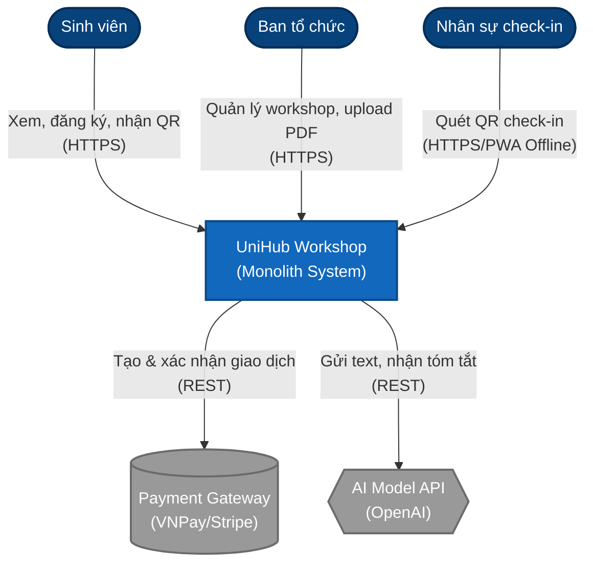
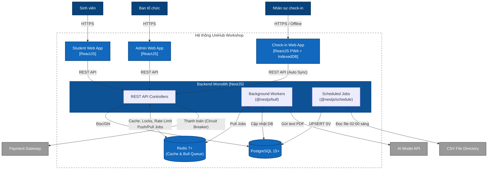
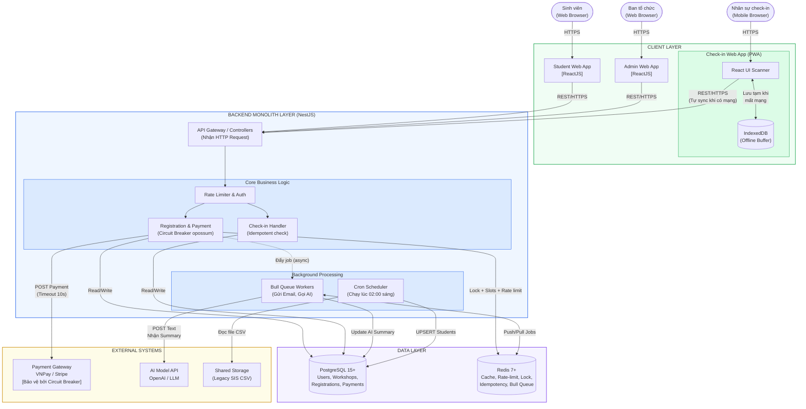
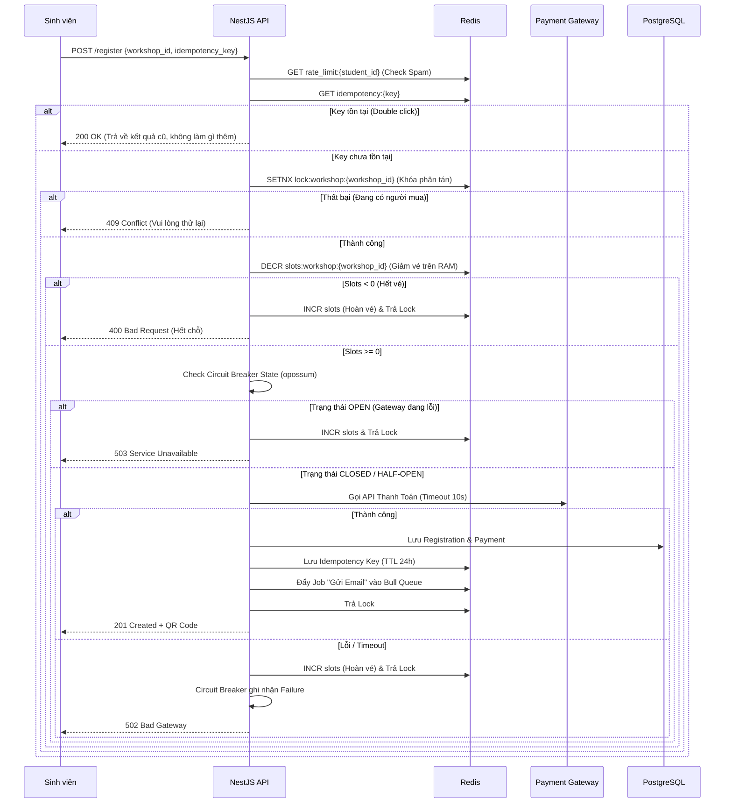
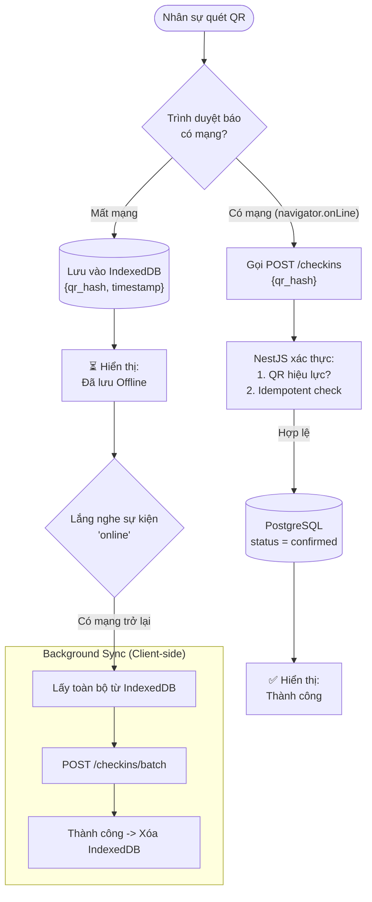

# UniHub Workshop — Technical Design

> **Phần 1 — Blueprint** | `design.md`
> Tài liệu thiết kế kỹ thuật cho hệ thống quản lý workshop "Tuần lễ kỹ năng và nghề nghiệp"

---

## Mục lục

- [UniHub Workshop — Technical Design](#unihub-workshop--technical-design)
  - [Mục lục](#mục-lục)
  - [1. Kiến trúc tổng thể](#1-kiến-trúc-tổng-thể)
    - [1.1 Lựa chọn kiến trúc](#11-lựa-chọn-kiến-trúc)
    - [1.2 Các thành phần chính](#12-các-thành-phần-chính)
    - [1.3 Kênh giao tiếp](#13-kênh-giao-tiếp)
    - [1.4 Thiết kế Thông báo (Extensible Notification)](#14-thiết-kế-thông-báo-extensible-notification)
  - [2. C4 Diagram](#2-c4-diagram)
    - [Level 1 — System Context](#level-1--system-context)
    - [Level 2 — Container](#level-2--container)
  - [3. High-Level Architecture Diagram](#3-high-level-architecture-diagram)
    - [3.1 Luồng Đăng ký \& Thanh toán (Distributed Lock + Circuit Breaker)](#31-luồng-đăng-ký--thanh-toán-distributed-lock--circuit-breaker)
    - [3.2 Luồng Check-in Offline (PWA + IndexedDB)](#32-luồng-check-in-offline-pwa--indexeddb)
    - [3.3 Luồng Tác vụ chạy nền (AI Summary \& Email qua Bull Queue)](#33-luồng-tác-vụ-chạy-nền-ai-summary--email-qua-bull-queue)
    - [3.4 Đồng bộ dữ liệu Legacy SIS (Cronjob nội bộ)](#34-đồng-bộ-dữ-liệu-legacy-sis-cronjob-nội-bộ)
  - [4. Thiết kế Dữ liệu Hệ thống](#4-thiết-kế-dữ-liệu-hệ-thống)
    - [4.1 Phân tích các loại dữ liệu chính](#41-phân-tích-các-loại-dữ-liệu-chính)
    - [4.2 Đề xuất loại Database phù hợp](#42-đề-xuất-loại-database-phù-hợp)
    - [4.3 Schema PostgreSQL 15+ (Source of Truth)](#43-schema-postgresql-15-source-of-truth)
    - [4.4 Redis 7+ (In-memory Store \& Queue)](#44-redis-7-in-memory-store--queue)
  - [5. Thiết kế Kiểm soát Truy cập (RBAC)](#5-thiết-kế-kiểm-soát-truy-cập-rbac)
    - [5.1 Mô hình phân quyền](#51-mô-hình-phân-quyền)
    - [5.2 Bảng quyền hạn chi tiết](#52-bảng-quyền-hạn-chi-tiết)
    - [5.3 Cơ chế thực thi quyền](#53-cơ-chế-thực-thi-quyền)
  - [6. Thiết kế các Cơ chế Bảo vệ Hệ thống](#6-thiết-kế-các-cơ-chế-bảo-vệ-hệ-thống)
    - [6.1 Kiểm soát tải đột biến (Rate Limiting)](#61-kiểm-soát-tải-đột-biến-rate-limiting)
    - [6.2 Xử lý cổng thanh toán không ổn định (Circuit Breaker)](#62-xử-lý-cổng-thanh-toán-không-ổn-định-circuit-breaker)
    - [6.3 Chống trừ tiền hai lần (Idempotency Key)](#63-chống-trừ-tiền-hai-lần-idempotency-key)
  - [7. Các Quyết định Kỹ thuật Quan trọng (ADR)](#7-các-quyết-định-kỹ-thuật-quan-trọng-adr)
    - [ADR-01: Monolith thay vì Microservices](#adr-01-monolith-thay-vì-microservices)
    - [ADR-02: PWA thay vì Mobile App native](#adr-02-pwa-thay-vì-mobile-app-native)
    - [ADR-03: PostgreSQL + Redis thay vì một database đơn](#adr-03-postgresql--redis-thay-vì-một-database-đơn)
    - [ADR-04: Bull Queue (Redis) thay vì Kafka / RabbitMQ](#adr-04-bull-queue-redis-thay-vì-kafka--rabbitmq)
    - [ADR-05: JWT thay vì Session-based Auth](#adr-05-jwt-thay-vì-session-based-auth)

---

## 1. Kiến trúc tổng thể

### 1.1 Lựa chọn kiến trúc

UniHub Workshop áp dụng kiến trúc **Monolith** cho backend, triển khai theo mô hình **3-tier** (Presentation – Application – Data).

Hệ thống tận dụng tối đa sức mạnh của **NestJS** và **Redis** để xử lý các bài toán về hiệu năng, tranh chấp dữ liệu và các tác vụ nền mà không cần phải triển khai thêm các hạ tầng phức tạp (như Message Broker hay Worker riêng). Phía Client, thay vì dùng Mobile App gốc, hệ thống sử dụng **Progressive Web App (PWA)** kết hợp **IndexedDB** để xử lý bài toán mất kết nối mạng.

### 1.2 Các thành phần chính

| Thành phần           | Vai trò                                                     | Công nghệ đề xuất                      |
| -------------------- | ----------------------------------------------------------- | -------------------------------------- |
| **Student Web App**  | Giao diện sinh viên: xem workshop, đăng ký, nhận QR         | ReactJS + TailwindCSS                  |
| **Admin Web App**    | Giao diện ban tổ chức: quản lý workshop, thống kê           | ReactJS + TailwindCSS                  |
| **Check-in Web App** | Quét QR check-in tại sự kiện. Hỗ trợ offline-first.         | ReactJS PWA + IndexedDB                |
| **Backend API**      | Xử lý toàn bộ nghiệp vụ, auth, bảo vệ hệ thống              | NestJS (tích hợp `@nestjs/bull`, Cron) |
| **PostgreSQL**       | Dữ liệu quan hệ chính (Source of Truth)                     | PostgreSQL 15+                         |
| **Redis**            | Slot cache, Rate Limiting, Idempotency, Lock, Message Queue | Redis 7+                               |
| **Payment Gateway**  | Xử lý thanh toán workshop có phí                            | VNPay / Stripe (mock)                  |
| **AI Model API**     | Sinh tóm tắt từ nội dung PDF                                | OpenAI / local LLM                     |
| **Legacy SIS**       | Hệ thống quản lý sinh viên cũ (chỉ export CSV)              | Dữ liệu tĩnh (đọc tự động qua thư mục) |

### 1.3 Kênh giao tiếp

| Kênh                       | Dùng khi             | Giao thức / Công nghệ                |
| -------------------------- | -------------------- | ------------------------------------ |
| **Synchronous REST**       | Cần phản hồi ngay    | Web App → Backend API                |
| **Background Job (Queue)** | Xử lý AI, Gửi Email  | NestJS đẩy job vào Redis Bull Queue  |
| **Scheduled Task (Cron)**  | Tác vụ định kỳ       | `@nestjs/schedule` chạy 02:00 sáng   |
| **Cache read-through**     | Giảm tải DB cao điểm | API đọc/ghi từ Redis trước, DB sau   |
| **Local Store + Sync**     | Offline Resilience   | PWA lưu IndexedDB → sync khi có mạng |

### 1.4 Thiết kế Thông báo (Extensible Notification)

Spec yêu cầu hệ thống phải dễ dàng bổ sung kênh thông báo mới (ví dụ: Telegram) mà không cần thay đổi lớn. Hệ thống áp dụng **Strategy Pattern** cho module thông báo.

**Nguyên tắc thiết kế:**

- Định nghĩa một interface chung `INotificationChannel` với phương thức `send(recipient, payload)`.
- Mỗi kênh (Email, Telegram...) là một class riêng implement interface này.
- `NotificationService` nhận danh sách channel qua **NestJS Dependency Injection** — để thêm kênh mới, chỉ cần tạo class mới và đăng ký vào module, không cần sửa logic nghiệp vụ.
- Toàn bộ việc gửi thông báo được đẩy vào **Bull Queue** (bất đồng bộ) để không block HTTP response.

```
┌────────────────────────────────┐
│        NotificationService     │
│  send(event, recipient)        │
│  → lặp qua danh sách channels  │
└──────────────┬─────────────────┘
               │ INotificationChannel
       ┌───────┴────────┐
       ▼                ▼
  EmailChannel    TelegramChannel   ← thêm kênh mới: chỉ tạo class này
  (Nodemailer)    (Bot API)
```

---

## 2. C4 Diagram

### Level 1 — System Context



### Level 2 — Container



---

## 3. High-Level Architecture Diagram

Sơ đồ này thể hiện toàn bộ luồng dữ liệu của kiến trúc Monolith, tập trung vào cách NestJS điều phối tất cả các tác vụ từ API, Background Jobs cho đến Scheduled Cron, kết hợp với sức mạnh của Redis và PostgreSQL.



### 3.1 Luồng Đăng ký & Thanh toán (Distributed Lock + Circuit Breaker)

Giải quyết bài toán: **Tranh chấp chỗ ngồi (12.000 user/10 phút)** và **Bảo vệ hệ thống khi Gateway lỗi**.



### 3.2 Luồng Check-in Offline (PWA + IndexedDB)

Giải quyết bài toán: **Hội trường mất kết nối Internet**.



### 3.3 Luồng Tác vụ chạy nền (AI Summary & Email qua Bull Queue)

Giải quyết bài toán: **Không block HTTP Request của ban tổ chức khi xử lý tác vụ nặng**.

```mermaid
    sequenceDiagram
        participant Admin
        participant API as NestJS Controller
        participant RD as Redis (Bull Queue)
        participant W as NestJS Worker Process
        participant AI as OpenAI API
        participant DB as PostgreSQL

        Admin->>API: POST /workshops/:id/pdf (Upload PDF)
        API->>RD: Thêm job vào "ai-summary-queue"
        API-->>Admin: 202 Accepted (Sẽ tóm tắt trong nền)

        Note over W,RD: Worker chạy độc lập ở background
        RD-->>W: Kéo Job mới
        W->>W: Đọc PDF bằng pdf-parse
        W->>AI: Gửi text sang LLM
        AI-->>W: Trả về văn bản tóm tắt
        W->>DB: UPDATE workshops SET ai_summary = ...
        Note over Admin,DB: Web tự động hiển thị Summary khi user refresh
```



### 3.4 Đồng bộ dữ liệu Legacy SIS (Cronjob nội bộ)

Giải quyết bài toán: **Đồng bộ tự động không cần server cron độc lập** và **xử lý an toàn file CSV từ hệ thống cũ**.

1. Đúng 02:00 sáng, hàm `@Cron('0 2 * * *')` trong NestJS tự động kích hoạt.
2. NestJS tìm file `students_YYYYMMDD.csv` mới nhất trong thư mục được mount sẵn.
3. **Kiểm tra file trước khi xử lý:** Nếu file không tồn tại hoặc rỗng → ghi log cảnh báo và dừng, không ném exception để tránh gián đoạn hệ thống.
4. Dùng **stream** để parse từng dòng (tránh tràn RAM với file lớn). Mỗi dòng được validate schema (đủ cột, `mssv` không rỗng); dòng lỗi format được bỏ qua và ghi vào log riêng (`sis_import_errors_YYYYMMDD.log`).
5. Thực thi lệnh **UPSERT** (`INSERT INTO students ... ON CONFLICT (mssv) DO UPDATE`) để xử lý an toàn dữ liệu trùng lặp — sinh viên đã tồn tại sẽ được cập nhật thông tin, không tạo bản ghi mới.
6. Sau khi hoàn thành, ghi log tóm tắt: tổng dòng xử lý, số dòng thành công, số dòng lỗi.
7. Toàn bộ luồng xử lý không sử dụng Table Lock, không làm gián đoạn API đang chạy.

---

## 4. Thiết kế Dữ liệu Hệ thống

Hệ thống sử dụng mô hình kết hợp **(Polyglot Persistence)** để tận dụng thế mạnh của từng công nghệ, đảm bảo vừa đáp ứng yêu cầu tính nhất quán (ACID) vừa đạt hiệu năng cao dưới tải đột biến.

### 4.1 Phân tích các loại dữ liệu chính

| Nhóm dữ liệu              | Đặc điểm                                                                          | Công nghệ xử lý   |
| :------------------------ | :-------------------------------------------------------------------------------- | :---------------- |
| **Quan hệ có cấu trúc**   | Sinh viên, workshop, đăng ký, thanh toán, check-in — đòi hỏi ACID tuyệt đối       | PostgreSQL 15+    |
| **In-memory / Cache**     | Rate-limit counter, Distributed lock, Idempotency key, Slot cache — cần tốc độ ms | Redis 7+          |
| **Offline (Client-side)** | QR hash tạm thời khi mất mạng, tự đồng bộ khi có kết nối                          | IndexedDB (PWA)   |
| **Phi cấu trúc**          | File PDF upload, văn bản tóm tắt AI — lưu path/text vào PostgreSQL                | PostgreSQL (TEXT) |

### 4.2 Đề xuất loại Database phù hợp

#### PostgreSQL 15+ (Relational Database / SQL)

- **Vai trò:** Cơ sở dữ liệu chính (Source of Truth) lưu trữ toàn bộ dữ liệu nghiệp vụ.
- **Lý do lựa chọn:**
  - Đảm bảo tính toàn vẹn dữ liệu (ACID) cho các giao dịch đăng ký có phí và cấp phát mã QR — nơi dữ liệu không được phép mất hay trùng lặp.
  - Hỗ trợ UPSERT (`INSERT ... ON CONFLICT DO UPDATE`) an toàn, phục vụ import dữ liệu sinh viên từ CSV hàng đêm mà không làm gián đoạn hệ thống.
  - Các bảng có quan hệ chặt chẽ với nhau (registration → payment → checkin), phù hợp với mô hình quan hệ hơn NoSQL document.

#### Redis 7+ (In-memory Data Store / NoSQL)

- **Vai trò:** Bộ đệm tốc độ cao, hàng đợi tác vụ nền và cơ chế bảo vệ hệ thống.
- **Lý do lựa chọn:**
  - Giảm tải trực tiếp cho PostgreSQL — database quan hệ sẽ bị thắt nút cổ chai (bottleneck) nếu nhận trực tiếp hàng ngàn request đăng ký cùng lúc.
  - Lưu trữ trên RAM, tốc độ phản hồi tính bằng mili-giây, chịu được 60% của 12.000 sinh viên dồn vào 3 phút đầu.
  - Hỗ trợ thao tác nguyên tử (Atomic): `INCR`, `DECR`, `SETNX` — phù hợp làm Distributed Lock và đếm slot vé.
  - TTL (Time-To-Live) tự động xóa dữ liệu hết hạn (Idempotency key sau 24h, Rate-limit key sau 10s).

### 4.3 Schema PostgreSQL 15+ (Source of Truth)

#### Bảng `students` (Sinh viên)

| Tên cột      | Kiểu dữ liệu | Ràng buộc                    | Mô tả                                                            |
| :----------- | :----------- | :--------------------------- | :--------------------------------------------------------------- |
| `id`         | UUID         | PRIMARY KEY                  | Định danh nội bộ của sinh viên                                   |
| `mssv`       | VARCHAR(20)  | UNIQUE, NOT NULL             | Mã số sinh viên                                                  |
| `full_name`  | VARCHAR(100) | NOT NULL                     | Họ và tên đầy đủ                                                 |
| `email`      | VARCHAR(100) | NOT NULL                     | Email liên hệ                                                    |
| `role`       | VARCHAR(20)  | NOT NULL DEFAULT `'student'` | Vai trò trong hệ thống (`student`, `organizer`, `checkin_staff`) |
| `updated_at` | TIMESTAMPTZ  | DEFAULT NOW()                | Thời gian cập nhật từ CSV                                        |

#### Bảng `workshops` (Sự kiện)

| Tên cột           | Kiểu dữ liệu  | Ràng buộc                   | Mô tả                                          |
| :---------------- | :------------ | :-------------------------- | :--------------------------------------------- |
| `id`              | UUID          | PRIMARY KEY                 | Định danh workshop                             |
| `title`           | VARCHAR(255)  | NOT NULL                    | Tên workshop                                   |
| `speaker_info`    | TEXT          |                             | Thông tin chi tiết về diễn giả                 |
| `room`            | VARCHAR(50)   | NOT NULL                    | Phòng/khu vực tổ chức                          |
| `start_time`      | TIMESTAMPTZ   | NOT NULL                    | Thời gian sự kiện diễn ra                      |
| `capacity`        | INT           | NOT NULL                    | Tổng số lượng vé tối đa                        |
| `available_slots` | INT           | CHECK (>= 0)                | Số vé còn trống (sync từ Redis về khi bớt tải) |
| `price`           | DECIMAL(10,2) | DEFAULT 0                   | Giá vé (0 = miễn phí)                          |
| `ai_summary`      | TEXT          |                             | Tóm tắt từ AI (NULL nếu chưa có PDF)           |
| `status`          | VARCHAR(20)   | NOT NULL DEFAULT `'active'` | Trạng thái (`active`, `cancelled`)             |

#### Bảng `registrations` (Đăng ký)

| Tên cột       | Kiểu dữ liệu | Ràng buộc        | Mô tả                                            |
| :------------ | :----------- | :--------------- | :----------------------------------------------- |
| `id`          | UUID         | PRIMARY KEY      | Định danh giao dịch đăng ký                      |
| `student_id`  | UUID         | FOREIGN KEY      | Trỏ đến `students`                               |
| `workshop_id` | UUID         | FOREIGN KEY      | Trỏ đến `workshops`                              |
| `status`      | VARCHAR(20)  | NOT NULL         | Trạng thái (`pending`, `confirmed`, `cancelled`) |
| `qr_hash`     | VARCHAR(255) | UNIQUE, NOT NULL | Mã QR check-in (UUID được hash)                  |
| `created_at`  | TIMESTAMPTZ  | DEFAULT NOW()    | Thời điểm đăng ký                                |

_Ràng buộc: UNIQUE kết hợp (`student_id`, `workshop_id`) — một sinh viên không thể đăng ký cùng một workshop hai lần._

#### Bảng `payments` (Thanh toán)

| Tên cột           | Kiểu dữ liệu  | Ràng buộc     | Mô tả                          |
| :---------------- | :------------ | :------------ | :----------------------------- |
| `id`              | UUID          | PRIMARY KEY   | Định danh giao dịch thanh toán |
| `registration_id` | UUID          | FOREIGN KEY   | Trỏ đến `registrations`        |
| `amount`          | DECIMAL(10,2) | NOT NULL      | Số tiền                        |
| `status`          | VARCHAR(20)   | NOT NULL      | `success`, `failed`, `timeout` |
| `transaction_id`  | VARCHAR(100)  |               | Mã đối soát từ Payment Gateway |
| `created_at`      | TIMESTAMPTZ   | DEFAULT NOW() | Thời điểm giao dịch            |

#### Bảng `checkins` (Lịch sử điểm danh)

| Tên cột       | Kiểu dữ liệu | Ràng buộc   | Mô tả                                   |
| :------------ | :----------- | :---------- | :-------------------------------------- |
| `id`          | UUID         | PRIMARY KEY | Định danh check-in                      |
| `qr_hash`     | VARCHAR(255) | FOREIGN KEY | Mã QR đã quét (trỏ đến `registrations`) |
| `workshop_id` | UUID         | FOREIGN KEY | Tham chiếu workshop                     |
| `scanned_at`  | TIMESTAMPTZ  | NOT NULL    | Thời gian quét thực tế trên app         |
| `status`      | VARCHAR(20)  | NOT NULL    | `synced`, `rejected`                    |

### 4.4 Redis 7+ (In-memory Store & Queue)

Đóng 3 vai trò cực kỳ quan trọng trong kiến trúc Monolith: **Bộ đệm**, **Khóa** và **Hàng đợi**.

| Key / Format                       | Type      | TTL              | Vai trò & Ý nghĩa                                                               |
| :--------------------------------- | :-------- | :--------------- | :------------------------------------------------------------------------------ |
| `rate_limit:{student_id}:register` | Integer   | 10 giây          | **Rate Limiter:** Đếm request, trả 429 nếu vượt 100 req/10s.                    |
| `lock:workshop:{id}`               | String    | 10 giây          | **Distributed Lock:** `SETNX` ngăn race-condition khi 100 người tranh vé cuối.  |
| `slots:workshop:{id}`              | Integer   | Không hết hạn    | **Slot Cache:** `DECR` nguyên tử giảm vé cực nhanh trên RAM trước khi ghi DB.   |
| `idempotency:{uuid}`               | Hash      | 24 giờ           | **Idempotency Key:** Lưu kết quả thanh toán. Chống trừ tiền 2 lần khi mạng lag. |
| `bull:email-queue:*`               | Hash/List | Quản lý bởi Bull | **Message Queue:** Hàng đợi các email cần gửi qua Nodemailer.                   |
| `bull:ai-queue:*`                  | Hash/List | Quản lý bởi Bull | **Message Queue:** Hàng đợi xử lý PDF và gọi AI API tóm tắt.                    |

---

## 5. Thiết kế Kiểm soát Truy cập (RBAC)

### 5.1 Mô hình phân quyền

Hệ thống áp dụng mô hình **RBAC (Role-Based Access Control)** — quyền hạn được gán theo vai trò (role), không gán trực tiếp cho từng người dùng. Có **3 role** tương ứng với 3 nhóm người dùng trong spec:

| Role            | Mô tả                                                  |
| :-------------- | :----------------------------------------------------- |
| `student`       | Sinh viên — xem workshop, đăng ký, check-in            |
| `organizer`     | Ban tổ chức — toàn quyền quản lý workshop, thống kê    |
| `checkin_staff` | Nhân sự check-in — chỉ được truy cập chức năng quét QR |

### 5.2 Bảng quyền hạn chi tiết

| Tính năng / Endpoint                              | `student` | `organizer` | `checkin_staff` |
| :------------------------------------------------ | :-------: | :---------: | :-------------: |
| Xem danh sách workshop (`GET /workshops`)         |    ✅     |     ✅      |       ✅        |
| Xem chi tiết workshop (`GET /workshops/:id`)      |    ✅     |     ✅      |       ✅        |
| Đăng ký workshop (`POST /registrations`)          |    ✅     |     ❌      |       ❌        |
| Xem QR của bản thân (`GET /registrations/me`)     |    ✅     |     ❌      |       ❌        |
| Tạo workshop mới (`POST /workshops`)              |    ❌     |     ✅      |       ❌        |
| Cập nhật workshop (`PATCH /workshops/:id`)        |    ❌     |     ✅      |       ❌        |
| Hủy workshop (`DELETE /workshops/:id`)            |    ❌     |     ✅      |       ❌        |
| Upload PDF tóm tắt (`POST /workshops/:id/pdf`)    |    ❌     |     ✅      |       ❌        |
| Xem thống kê đăng ký (`GET /workshops/:id/stats`) |    ❌     |     ✅      |       ❌        |
| Quét QR check-in (`POST /checkins`)               |    ❌     |     ❌      |       ✅        |
| Đồng bộ check-in offline (`POST /checkins/batch`) |    ❌     |     ❌      |       ✅        |

### 5.3 Cơ chế thực thi quyền

**Xác thực (Authentication):**

- Người dùng đăng nhập bằng MSSV/email + mật khẩu.
- Backend trả về **JWT (JSON Web Token)** có chứa `{ sub: userId, role: "student" | "organizer" | "checkin_staff" }`.
- JWT được ký bằng `RS256` (asymmetric) và có thời hạn 24 giờ.
- Client lưu JWT trong `httpOnly cookie` (không lưu localStorage để tránh XSS).

**Phân quyền (Authorization) tại Backend (NestJS):**

- Mỗi API endpoint được bảo vệ bởi 2 lớp guard:
  1. **`JwtAuthGuard`** — kiểm tra token hợp lệ, chưa hết hạn.
  2. **`RolesGuard`** — đọc metadata `@Roles('organizer')` trên controller, so sánh với `role` trong JWT payload.
- Nếu không có token → `401 Unauthorized`. Nếu sai role → `403 Forbidden`.

```
Request → JwtAuthGuard → RolesGuard → Controller Handler
            (xác thực)   (phân quyền)
```

**Phân quyền tại Frontend:**

- **Student Web App:** Sau khi login, menu và nút chức năng được render dựa theo `role` trong JWT payload (decode phía client). Không có route nào dẫn đến trang admin.
- **Admin Web App:** Chỉ render được khi role là `organizer`; các route khác redirect về trang login.
- **Check-in Web App:** Chỉ render được khi role là `checkin_staff`; không có UI nào liên quan đến quản lý workshop.

> **Lưu ý:** Việc ẩn UI ở frontend chỉ mang tính UX. Tầng bảo mật thực sự nằm ở **RolesGuard** phía Backend API — mọi request đều phải vượt qua guard này dù client có bypass UI hay không.

---

## 6. Thiết kế các Cơ chế Bảo vệ Hệ thống

### 6.1 Kiểm soát tải đột biến (Rate Limiting)

**Bài toán:** 12.000 sinh viên truy cập trong 10 phút đầu, 60% dồn vào 3 phút đầu. Một số client có thể liên tục gửi request gây quá tải Backend API.

**Giải pháp: Fixed Window Counter trên Redis**

Thuật toán **Fixed Window** được chọn vì đủ đơn giản để triển khai với Redis nguyên bản (`INCR` + `EXPIRE`) và hiệu quả với bài toán này — mỗi cửa sổ thời gian 10 giây được reset hoàn toàn, tránh tích lũy state phức tạp.

**Cơ chế hoạt động:**

1. Mỗi request đến endpoint `/register`, NestJS Guard thực hiện lệnh `INCR rate_limit:{student_id}:register`.
2. Nếu đây là request đầu tiên trong cửa sổ (giá trị trả về = 1) → đặt `EXPIRE` 10 giây cho key.
3. Nếu giá trị trả về **> 100** → trả ngay `HTTP 429 Too Many Requests` mà không xử lý thêm, không gọi xuống DB.
4. Nếu giá trị trả về **≤ 100** → cho phép đi tiếp.

**Cấu hình:**

| Tham số                   | Giá trị                                                           |
| :------------------------ | :---------------------------------------------------------------- |
| Ngưỡng (threshold)        | 100 request                                                       |
| Cửa sổ thời gian (window) | 10 giây                                                           |
| Phạm vi áp dụng           | Theo `student_id` (mỗi user riêng, không ảnh hưởng nhau)          |
| Response khi vượt         | `HTTP 429` + header `Retry-After: 10`                             |
| Vị trí thực thi           | `RateLimitGuard` — middleware layer, trước toàn bộ business logic |

**Sơ đồ luồng:**

```
Request đến /register
       ↓
INCR rate_limit:{student_id}:register
       ↓
  count > 100? ──Yes──→ 429 Too Many Requests
       ↓ No
  Tiếp tục xử lý đăng ký
```

### 6.2 Xử lý cổng thanh toán không ổn định (Circuit Breaker)

**Bài toán:** Cổng thanh toán (VNPay/Stripe) có thể gặp sự cố kéo dài. Nếu không có cơ chế bảo vệ, mỗi request đăng ký có phí sẽ phải chờ timeout (10 giây), khiến tất cả worker threads bị chiếm giữ và kéo sập toàn bộ dịch vụ.

**Giải pháp: Circuit Breaker với thư viện `opossum` (NestJS)**

Circuit Breaker hoạt động như một cầu dao điện — tự ngắt kết nối đến Payment Gateway khi phát hiện lỗi liên tiếp, giúp hệ thống **fail fast** thay vì chờ timeout.

**Ba trạng thái:**

| Trạng thái               | Hành vi                              | Điều kiện chuyển                     |
| :----------------------- | :----------------------------------- | :----------------------------------- |
| **CLOSED** (Bình thường) | Cho phép mọi request qua Gateway     | Khi tỷ lệ lỗi vượt ngưỡng → OPEN     |
| **OPEN** (Đang lỗi)      | Chặn toàn bộ request, trả ngay `503` | Sau `resetTimeout` (30s) → HALF-OPEN |
| **HALF-OPEN** (Thăm dò)  | Cho 1 request thử qua                | Thành công → CLOSED; Thất bại → OPEN |

**Cấu hình:**

| Tham số                    | Giá trị   | Ý nghĩa                                          |
| :------------------------- | :-------- | :----------------------------------------------- |
| `errorThresholdPercentage` | 50%       | Khi ≥ 50% request lỗi trong cửa sổ → OPEN        |
| `volumeThreshold`          | 5 request | Cần ít nhất 5 request mới bắt đầu tính tỷ lệ lỗi |
| `timeout`                  | 10.000ms  | Mỗi request thanh toán timeout sau 10 giây       |
| `resetTimeout`             | 30.000ms  | Sau 30 giây ở trạng thái OPEN → thử HALF-OPEN    |

**Graceful Degradation:** Khi Circuit Breaker ở trạng thái OPEN, các tính năng không liên quan đến thanh toán (xem workshop, check-in) vẫn hoạt động bình thường. Chỉ luồng đăng ký có phí bị ảnh hưởng — phản hồi `503 Service Unavailable` với thông báo rõ ràng cho sinh viên.

### 6.3 Chống trừ tiền hai lần (Idempotency Key)

**Bài toán:** Sinh viên nhấn "Thanh toán" và mạng lag — client retry lại request. Nếu server đã xử lý lần 1 nhưng response chưa về kịp, lần 2 sẽ tạo thêm một giao dịch và trừ tiền lần nữa.

**Giải pháp: Idempotency Key lưu trên Redis**

**Cơ chế hoạt động:**

1. **Client sinh key:** Trước khi gửi request, client tạo một UUID ngẫu nhiên (`crypto.randomUUID()`). Key này được đính kèm trong header: `Idempotency-Key: <uuid>`.
2. **Server kiểm tra:** Khi nhận request, NestJS thực hiện `GET idempotency:{uuid}` trên Redis.
   - **Key tồn tại** → Trả về kết quả đã lưu (`200 OK` + dữ liệu cũ), không xử lý thêm.
   - **Key chưa tồn tại** → Tiếp tục xử lý bình thường.
3. **Lưu kết quả:** Sau khi xử lý thành công, lưu kết quả vào Redis: `SET idempotency:{uuid} <response_json> EX 86400` (TTL 24 giờ).
4. **Retry an toàn:** Client có thể retry bao nhiêu lần cũng được — server luôn trả về kết quả cũ.

**Thiết kế:**

| Tham số     | Giá trị                                                          |
| :---------- | :--------------------------------------------------------------- |
| Key format  | `idempotency:{client-uuid}`                                      |
| Value       | JSON string chứa `{ status, registration_id, qr_hash }`          |
| TTL         | 24 giờ (đủ để cover mọi tình huống retry trong ngày)             |
| Nơi lưu     | Redis (tốc độ đọc nhanh, tự động xóa khi hết TTL)                |
| Ai sinh key | **Client** — tránh server phải đồng bộ key trong distributed env |

---

## 7. Các Quyết định Kỹ thuật Quan trọng (ADR)

### ADR-01: Monolith thay vì Microservices

|                |                                                                                                                                                                                                                                     |
| :------------- | :---------------------------------------------------------------------------------------------------------------------------------------------------------------------------------------------------------------------------------- |
| **Quyết định** | Dùng NestJS Monolith duy nhất cho toàn bộ backend                                                                                                                                                                                   |
| **Lý do**      | Hệ thống có quy mô vừa (3 nhóm user, ~6 tính năng chính). Monolith dễ phát triển, debug và deploy hơn trong bối cảnh đồ án. Microservices mang lại overhead về network, tracing, service discovery không cần thiết ở giai đoạn này. |
| **Đánh đổi**   | Khó scale từng phần độc lập sau này. Tuy nhiên, kiến trúc NestJS Monolith với module hóa rõ ràng vẫn cho phép tách thành Microservices sau khi cần.                                                                                 |

### ADR-02: PWA thay vì Mobile App native

|                |                                                                                                                                                                     |
| :------------- | :------------------------------------------------------------------------------------------------------------------------------------------------------------------ |
| **Quyết định** | Check-in app dùng ReactJS PWA + IndexedDB thay vì React Native / Flutter                                                                                            |
| **Lý do**      | PWA không cần publish lên App Store, cài đặt tức thì qua browser, dùng chung codebase ReactJS với Student/Admin app. IndexedDB đủ đáp ứng yêu cầu offline check-in. |
| **Đánh đổi**   | Không truy cập được camera native API một số thiết bị cũ, hiệu năng quét QR thấp hơn native app. Chấp nhận được vì nhân sự dùng thiết bị hiện đại.                  |

### ADR-03: PostgreSQL + Redis thay vì một database đơn

|                |                                                                                                                                                                                                                                              |
| :------------- | :------------------------------------------------------------------------------------------------------------------------------------------------------------------------------------------------------------------------------------------- |
| **Quyết định** | Polyglot Persistence: PostgreSQL làm Source of Truth, Redis làm in-memory layer                                                                                                                                                              |
| **Lý do**      | PostgreSQL không đủ nhanh để chịu 12.000 concurrent requests với Distributed Lock và Rate Limiting. Redis cung cấp atomic operations (`SETNX`, `INCR`) trên RAM, phản hồi trong mili-giây. Hai hệ thống bổ sung cho nhau thay vì cạnh tranh. |
| **Đánh đổi**   | Tăng độ phức tạp vận hành (2 hệ thống cần maintain). Rủi ro mất dữ liệu Redis khi restart (giảm thiểu bằng cách chỉ lưu ephemeral data trên Redis, Source of Truth vẫn ở PostgreSQL).                                                        |

### ADR-04: Bull Queue (Redis) thay vì Kafka / RabbitMQ

|                |                                                                                                                                                                                                                           |
| :------------- | :------------------------------------------------------------------------------------------------------------------------------------------------------------------------------------------------------------------------ |
| **Quyết định** | Dùng `@nestjs/bull` (Redis-backed queue) thay vì Message Broker riêng biệt                                                                                                                                                |
| **Lý do**      | Redis đã có trong stack (phục vụ Cache + Lock). Tận dụng Redis làm Queue tránh phải deploy thêm Kafka/RabbitMQ — giảm hạ tầng. `@nestjs/bull` tích hợp tốt với NestJS, đủ đáp ứng volume job (email + AI) ở quy mô đồ án. |
| **Đánh đổi**   | Không có message durability cao như Kafka. Nếu Redis restart trong lúc có job đang xử lý có thể mất job. Chấp nhận được vì job thất bại có thể retry thủ công, không phải giao dịch tài chính.                            |

### ADR-05: JWT thay vì Session-based Auth

|                |                                                                                                                                                                                                  |
| :------------- | :----------------------------------------------------------------------------------------------------------------------------------------------------------------------------------------------- |
| **Quyết định** | Xác thực bằng JWT (stateless) thay vì Session lưu trên server                                                                                                                                    |
| **Lý do**      | Ba frontend app (Student, Admin, Check-in) có thể xác thực độc lập mà không cần shared session store. JWT chứa `role` trong payload giúp RolesGuard phân quyền nhanh mà không cần thêm DB query. |
| **Đánh đổi**   | Không thể revoke token trước khi hết hạn (nếu tài khoản bị khóa). Giảm thiểu bằng cách đặt TTL ngắn (24h) và dùng `httpOnly cookie` để bảo vệ khỏi XSS.                                          |
