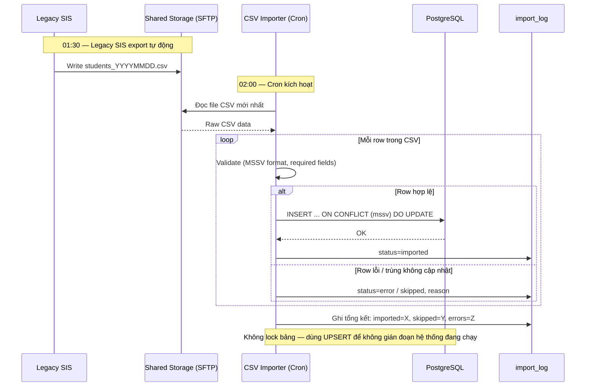
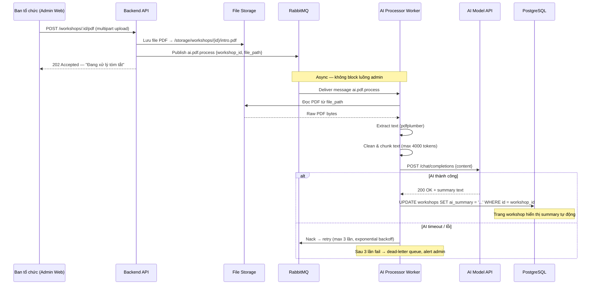
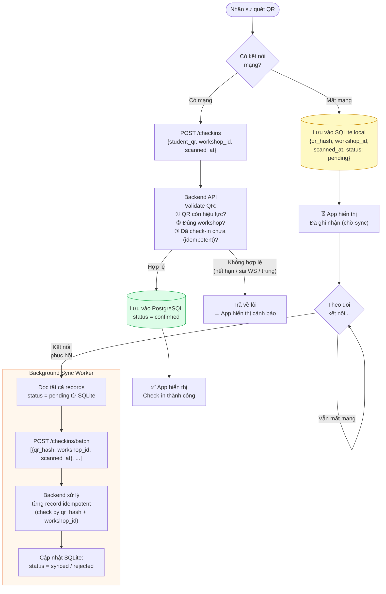

# UniHub Workshop — Technical Design

> **Phần 1 — Blueprint** | `design.md`  
> Tài liệu thiết kế kỹ thuật cho hệ thống quản lý workshop "Tuần lễ kỹ năng và nghề nghiệp"

---

## Mục lục

1. [Kiến trúc tổng thể](#1-kiến-trúc-tổng-thể)
2. [C4 Diagram](#2-c4-diagram)
   - [Level 1 — System Context](#level-1--system-context)
   - [Level 2 — Container](#level-2--container)
3. [High-Level Architecture Diagram](#3-high-level-architecture-diagram)

---

## 1. Kiến trúc tổng thể

### 1.1 Lựa chọn kiến trúc

UniHub Workshop áp dụng kiến trúc **Modular Monolith kết hợp Event-Driven** cho backend, triển khai theo mô hình **3-tier** (Presentation – Application – Data).

**Lý do không chọn Microservices:**

- Scope đồ án không đủ lớn để tận dụng lợi thế của microservices.
- Overhead triển khai và vận hành quá cao so với đội nhỏ.
- Modular monolith vẫn cho phép tách biệt logic theo domain rõ ràng.

**Lý do chọn Event-Driven cho một số luồng:**

- Thông báo đa kênh (app, email, Telegram tương lai) cần decoupling — dùng Message Broker để publisher không phụ thuộc consumer.
- CSV import ban đêm và AI Summary processing là tác vụ async nặng — không nên block HTTP request.
- Check-in offline cần cơ chế sync bất đồng bộ khi kết nối được phục hồi.

---

### 1.2 Các thành phần chính

| Thành phần               | Vai trò                                                      | Công nghệ đề xuất     |
| ------------------------ | ------------------------------------------------------------ | --------------------- |
| **Student Web App**      | Giao diện sinh viên: xem workshop, đăng ký, nhận QR          | Next.js 14 / React    |
| **Admin Web App**        | Giao diện ban tổ chức: quản lý workshop, thống kê            | Next.js 14 / React    |
| **Mobile App**           | Nhân sự quét QR, offline-first                               | React Native + SQLite |
| **Backend API**          | Xử lý nghiệp vụ, auth, bảo vệ hệ thống                       | Node.js / NestJS      |
| **PostgreSQL**           | Dữ liệu quan hệ chính                                        | PostgreSQL 15+        |
| **Redis**                | Slot cache, Rate Limiting, Idempotency Key, Distributed Lock | Redis 7+              |
| **RabbitMQ**             | Message Broker cho thông báo và tác vụ async                 | RabbitMQ 3.x          |
| **Notification Service** | Gửi email (SMTP), push notification (FCM)                    | Node.js worker        |
| **AI Processor**         | Trích xuất PDF, gọi AI Model, lưu summary                    | Python + pdfplumber   |
| **CSV Importer**         | Cron job nhập dữ liệu sinh viên                              | Node.js / cron        |
| **Payment Gateway**      | Xử lý thanh toán workshop có phí                             | VNPay / Stripe (mock) |
| **AI Model API**         | Sinh tóm tắt từ nội dung PDF                                 | OpenAI / local LLM    |
| **Legacy SIS**           | Hệ thống quản lý sinh viên cũ (chỉ export CSV)               | External              |

---

### 1.3 Kênh giao tiếp giữa các thành phần

| Kênh                        | Dùng khi              | Ví dụ                                        |
| --------------------------- | --------------------- | -------------------------------------------- |
| **Synchronous REST**        | Cần phản hồi ngay     | Web/Mobile App → Backend API                 |
| **Asynchronous (RabbitMQ)** | Không cần chờ kết quả | Backend publish → Notification, AI Processor |
| **Batch (Cron)**            | Tác vụ định kỳ        | CSV Importer chạy 02:00 sáng                 |
| **Cache read-through**      | Giảm tải DB cao điểm  | Slot còn lại: Redis trước, PostgreSQL sau    |
| **Local store + sync**      | Offline resilience    | Mobile App: SQLite → sync khi có mạng        |

---

### 1.4 Phân tích ảnh hưởng khi một thành phần gặp sự cố

| Thành phần bị lỗi               | Ảnh hưởng                                               | Phần còn lại bình thường                            |
| ------------------------------- | ------------------------------------------------------- | --------------------------------------------------- |
| **Payment Gateway**             | Đăng ký có phí bị chặn; Circuit Breaker kích hoạt → 503 | Xem workshop, đăng ký miễn phí, check-in, admin     |
| **RabbitMQ**                    | Email/push xác nhận trễ hoặc mất                        | Đăng ký và check-in không bị ảnh hưởng              |
| **Notification Service**        | Email/push không gửi được                               | Nghiệp vụ cốt lõi không bị ảnh hưởng                |
| **AI Processor / AI Model API** | AI Summary không được tạo hoặc trễ                      | Trang workshop vẫn hiển thị, chỉ thiếu phần summary |
| **Redis**                       | Rate limiting & cache tắt; fallback đọc thẳng DB        | Hệ thống tiếp tục, hiệu năng giảm                   |
| **CSV Importer**                | Dữ liệu SV không cập nhật đêm đó                        | Sinh viên đã có trong DB vẫn dùng bình thường       |
| **Backend API**                 | Toàn bộ Web/Mobile không gửi được request               | N/A — cần load balancer + multiple instance         |
| **PostgreSQL**                  | Toàn bộ hệ thống ngừng đọc/ghi                          | N/A — cần replication/backup                        |

---

## 2. C4 Diagram

### Level 1 — System Context

Thể hiện UniHub Workshop trong bức tranh toàn cảnh: ai dùng hệ thống và hệ thống ngoài nào được tích hợp.

<script type="module">
  import mermaid from 'https://cdn.jsdelivr.net/npm/mermaid@10/dist/mermaid.esm.min.mjs';
  mermaid.initialize({ startOnLoad: true });
</script>

<div class="mermaid">
    flowchart TD
        %% Định nghĩa các Actor (Người dùng)
        student(["Sinh viên"])
        organizer(["Ban tổ chức"])
        checkin_staff(["Nhân sự check-in"])

        %% Định nghĩa System (Hệ thống chính)
        unihub["UniHub Workshop<br/>(Hệ thống quản lý)"]

        %% Định nghĩa External Systems (Hệ thống bên ngoài)
        payment[("Payment Gateway<br/>(VNPay/Stripe)")]
        ai_api{{"AI Model API<br/>(OpenAI/LLM)"}}
        legacy_sis[("Legacy SIS<br/>(Hệ thống cũ)")]

        %% Các luồng tương tác
        student -- "Xem, đăng ký, nhận QR<br/>(HTTPS)" ---> unihub
        organizer -- "Quản lý workshop, upload PDF<br/>(HTTPS)" ---> unihub
        checkin_staff -- "Quét QR check-in<br/>(HTTPS)" ---> unihub

        unihub -- "Tạo & xác nhận giao dịch<br/>(HTTPS/REST)" ---> payment
        unihub -- "Gửi PDF, nhận tóm tắt<br/>(HTTPS/REST)" ---> ai_api
        legacy_sis -- "Export CSV hàng đêm<br/>(SFTP/File)" ---> unihub

        %% Áp dụng style màu sắc chuẩn C4
        classDef person fill:#08427b,stroke:#052e56,color:#fff,stroke-width:2px
        classDef system fill:#1168bd,stroke:#0b4884,color:#fff,stroke-width:2px
        classDef external fill:#999999,stroke:#6b6b6b,color:#fff,stroke-width:2px

        class student,organizer,checkin_staff person
        class unihub system
        class payment,ai_api,legacy_sis external

</div>

---

### Level 2 — Container

Phân rã UniHub Workshop thành các container với công nghệ đề xuất và cách chúng giao tiếp.

<script type="module">
  import mermaid from 'https://cdn.jsdelivr.net/npm/mermaid@10/dist/mermaid.esm.min.mjs';
  mermaid.initialize({ startOnLoad: true });
</script>

<div class="mermaid">
    flowchart TD
        %% Định nghĩa bảng màu mô phỏng chuẩn C4
        classDef person fill:#08427B,stroke:#052E56,color:#FFFFFF,stroke-width:2px
        classDef container fill:#1168BD,stroke:#0B4884,color:#FFFFFF,stroke-width:2px
        classDef external fill:#999999,stroke:#6B6B6B,color:#FFFFFF,stroke-width:2px

        %% Các hệ thống bên ngoài
        payment["**Payment Gateway**<br/>[VNPay / Stripe]"]:::external
        ai_api["**AI Model API**<br/>[OpenAI / local LLM]"]:::external
        legacy_sis["**Legacy SIS**<br/>[Export CSV]"]:::external

        %% Người dùng (Sử dụng hình chữ nhật thay cho icon người)
        student["**Sinh viên**"]:::person
        organizer["**Ban tổ chức**"]:::person
        checkin_staff["**Nhân sự check-in**"]:::person

        %% Ranh giới Hệ thống (System Boundary)
        subgraph unihub_boundary ["Hệ thống UniHub Workshop"]
            direction TB

            web_student["**Student Web App**<br/>[Next.js 14 / React]<br/><br/>Xem lịch, đăng ký workshop,<br/>hiển thị QR & thông báo"]:::container
            web_admin["**Admin Web App**<br/>[Next.js 14 / React]<br/><br/>Quản lý workshop, upload PDF,<br/>thống kê đăng ký"]:::container
            mobile_app["**Mobile App**<br/>[React Native + SQLite]<br/><br/>Quét QR check-in,<br/>lưu offline vào SQLite local"]:::container

            backend_api["**Backend API**<br/>[Node.js / NestJS]<br/><br/>Toàn bộ nghiệp vụ: auth, RBAC,<br/>đăng ký, check-in, rate limit,<br/>circuit breaker, idempotency"]:::container

            postgres[("**PostgreSQL**<br/>[PostgreSQL 15+]<br/><br/>Users, Workshops, Registrations,<br/>Payments, CheckIns, Summaries")]:::container
            redis[("**Redis**<br/>[Redis 7+]<br/><br/>Slot cache, Rate-limit counters,<br/>Idempotency keys, Distributed lock")]:::container

            broker{{"**RabbitMQ**<br/>[RabbitMQ 3.x]<br/><br/>Message broker:<br/>notify.*, ai.pdf.*, csv.import.*"}}:::container

            notif_svc["**Notification Service**<br/>[Node.js worker]<br/><br/>Gửi email (SMTP / Nodemailer)<br/>và push (FCM/APNs)"]:::container
            ai_worker["**AI Processor Worker**<br/>[Python + pdfplumber]<br/><br/>Extract PDF ➔ gọi AI API<br/>➔ lưu summary vào DB"]:::container
            csv_importer["**CSV Importer**<br/>[Node.js + cron]<br/><br/>Chạy 02:00 sáng: đọc CSV<br/>từ shared storage, UPSERT vào DB"]:::container
        end

        %% Các luồng tương tác (Bao gồm cả giao thức)
        student -->|"Dùng<br/>[HTTPS]"| web_student
        organizer -->|"Dùng<br/>[HTTPS]"| web_admin
        checkin_staff -->|"Dùng<br/>[HTTPS]"| mobile_app

        web_student -->|"REST API calls<br/>[HTTPS/JSON]"| backend_api
        web_admin -->|"REST API calls<br/>[HTTPS/JSON]"| backend_api
        mobile_app -->|"REST API calls<br/>sync khi có mạng<br/>[HTTPS/JSON]"| backend_api

        backend_api -->|"Đọc/ghi dữ liệu<br/>[TCP/SQL]"| postgres
        backend_api -->|"Cache, lock,<br/>rate limit, idempotency<br/>[TCP]"| redis
        backend_api -->|"Publish events<br/>notify, ai, import<br/>[AMQP]"| broker
        backend_api -->|"Tạo giao dịch<br/>(Circuit Breaker)<br/>[HTTPS/REST]"| payment

        broker -->|"Consume notify.*<br/>[AMQP]"| notif_svc
        broker -->|"Consume ai.pdf.*<br/>[AMQP]"| ai_worker
        broker -->|"Trigger / schedule<br/>[AMQP / cron]"| csv_importer

        notif_svc -->|"Đọc thông tin<br/>gửi thông báo<br/>[TCP/SQL]"| postgres
        ai_worker -->|"POST nội dung PDF,<br/>nhận summary<br/>[HTTPS/REST]"| ai_api
        ai_worker -->|"Lưu AI summary<br/>[TCP/SQL]"| postgres
        csv_importer -->|"UPSERT sinh viên<br/>[TCP/SQL]"| postgres

        legacy_sis -->|"File CSV<br/>vào shared storage<br/>[SFTP/File]"| csv_importer

        %% Định dạng nét đứt cho viền hệ thống (Boundary)
        style unihub_boundary fill:none,stroke:#444444,stroke-width:1px,stroke-dasharray: 5 5

</div>

## 3. High-Level Architecture Diagram

Sơ đồ này thể hiện toàn bộ luồng dữ liệu, tập trung vào bốn điểm quan trọng: **(A)** cơ chế bảo vệ trong cao điểm đăng ký, **(B)** tích hợp Payment Gateway, **(C)** tích hợp AI Model, **(D)** luồng check-in offline.

```mermaid
flowchart TB
    %% ── Actors ──────────────────────────────────────────────
    SV(["Sinh viên\n(Web Browser)"])
    BTC(["Ban tổ chức\n(Web Browser)"])
    NS(["Nhân sự check-in\n(Mobile App)"])

    %% ── Client layer ─────────────────────────────────────────
    subgraph CLIENT["CLIENT LAYER"]
        direction LR
        WebSV["Student Web App\nNext.js / React"]
        WebAdmin["Admin Web App\nNext.js / React"]
        subgraph MOBILE["Mobile App  (React Native)"]
            direction TB
            MApp["Check-in UI\n(QR Scanner)"]
            SQLite[("SQLite\nLocal Store\n(offline buffer)")]
        end
    end

    SV -- "HTTPS" --> WebSV
    BTC -- "HTTPS" --> WebAdmin
    NS -- "HTTPS" --> MApp

    %% ── API Layer ────────────────────────────────────────────
    subgraph API["API LAYER"]
        direction TB
        LB["Load Balancer / API Gateway"]
        subgraph BACKEND["Backend API  (NestJS / Node.js)"]
            direction LR
            RL["① Rate Limiter\nToken Bucket\n100 req/10s per user"]
            AUTH["② Auth Middleware\nJWT + RBAC\n3 roles"]
            REG["③ Registration Handler\nDistributed Lock (Redis)\nIdempotency Key check"]
            PAY["④ Payment Handler\nCircuit Breaker\nClosed / Open / Half-Open"]
            CHK["⑤ Check-in Handler\nIdempotent by QR hash"]
        end
        LB --> RL --> AUTH
        AUTH --> REG
        AUTH --> PAY
        AUTH --> CHK
    end

    WebSV -- "REST/HTTPS" --> LB
    WebAdmin -- "REST/HTTPS" --> LB
    MApp -- "REST/HTTPS\n(sync khi có mạng)" --> LB
    MApp <-.->|"offline\nbuffer"| SQLite

    %% ── Data layer ───────────────────────────────────────────
    subgraph DATA["DATA LAYER"]
        direction LR
        PG[("PostgreSQL 15+\nusers · workshops\nregistrations · payments\ncheckins · ai_summary")]
        RD[("Redis 7+\nSlot cache\nRate-limit counter\nIdempotency keys\nDistributed lock")]
        MQ["RabbitMQ\nExchanges:\nnotify.*\nai.pdf.*\ncsv.import.*"]
    end

    REG -- "read/write" --> PG
    REG -- "lock + idempotency\n+ slot cache" --> RD
    PAY -- "read/write" --> PG
    CHK -- "read/write" --> PG
    AUTH -- "read token" --> RD
    RL -- "counter" --> RD
    BACKEND -- "publish event" --> MQ

    %% ── Worker layer ─────────────────────────────────────────
    subgraph WORKERS["WORKER / INTEGRATION LAYER"]
        direction TB
        NS_SVC["Notification Service\nNode.js worker\nEmail (SMTP) · Push (FCM)"]
        AI_W["AI Processor Worker\nPython + pdfplumber\nExtract PDF → AI API → Save"]
        CSV_IMP["CSV Importer\nNode.js + cron\n02:00 sáng — UPSERT students"]
    end

    MQ -- "consume notify.*" --> NS_SVC
    MQ -- "consume ai.pdf.*" --> AI_W
    MQ -- "trigger / cron" --> CSV_IMP
    NS_SVC -- "read user info" --> PG
    AI_W -- "save summary" --> PG
    CSV_IMP -- "UPSERT students" --> PG

    %% ── External systems ─────────────────────────────────────
    subgraph EXT["EXTERNAL SYSTEMS"]
        direction LR
        PGW["Payment Gateway\nVNPay / Stripe\n[Circuit Breaker bảo vệ]"]
        AIAPI["AI Model API\nOpenAI / local LLM\n[Async, non-blocking]"]
        SIS["Legacy SIS\nHệ thống quản lý SV\n[Một chiều — CSV qua SFTP]"]
    end

    PAY -- "POST payment\n(timeout 10s)" --> PGW
    AI_W -- "POST content\nnhận summary" --> AIAPI
    SIS -- "Export CSV\nhàng đêm" --> CSV_IMP

    %% ── Styling ──────────────────────────────────────────────
    style CLIENT fill:#f0fdf4,stroke:#16a34a,stroke-width:1.5px
    style API fill:#eff6ff,stroke:#2563eb,stroke-width:1.5px
    style DATA fill:#f5f3ff,stroke:#7c3aed,stroke-width:1.5px
    style WORKERS fill:#fff7ed,stroke:#ea580c,stroke-width:1.5px
    style EXT fill:#fefce8,stroke:#ca8a04,stroke-width:1.5px
    style MOBILE fill:#dcfce7,stroke:#16a34a,stroke-width:1px
    style BACKEND fill:#dbeafe,stroke:#2563eb,stroke-width:1px
```



---

### 3.1 Luồng tích hợp Legacy SIS — CSV Import



---

### 3.2 Luồng tích hợp Payment Gateway với Circuit Breaker

```mermaid
sequenceDiagram
    participant SV as Sinh viên (Web App)
    participant API as Backend API
    participant RD as Redis
    participant CB as Circuit Breaker State
    participant PGW as Payment Gateway
    participant PG as PostgreSQL
    participant MQ as RabbitMQ

    SV->>API: POST /register {workshop_id, idempotency_key}
    API->>RD: GET idempotency:{key}
    alt Key đã tồn tại (duplicate request)
        RD-->>API: Cached result
        API-->>SV: 200 OK (cached — không xử lý lại)
    else Key chưa tồn tại
        API->>RD: SETNX lock:slot:{workshop_id} (10s TTL)
        alt Không lấy được lock (slot đang tranh chấp)
            API-->>SV: 409 Conflict — thử lại sau
        else Lock thành công
            API->>PG: SELECT available_slots WHERE id = workshop_id FOR UPDATE
            PG-->>API: slots = N

            alt slots <= 0
                API-->>SV: 400 — Hết chỗ
            else slots > 0
                API->>CB: Kiểm tra trạng thái Circuit Breaker
                alt CB = OPEN
                    CB-->>API: OPEN
                    API-->>SV: 503 — Thanh toán tạm thời không khả dụng
                else CB = CLOSED hoặc HALF-OPEN
                    API->>PGW: POST /payments {amount, order_id, idempotency_key}
                    alt Thanh toán thành công
                        PGW-->>API: 200 OK + transaction_id
                        API->>CB: Ghi nhận SUCCESS
                        API->>PG: UPDATE slots -= 1; INSERT registration; INSERT payment
                        API->>RD: SET idempotency:{key} = {result} (TTL 24h)
                        API->>MQ: Publish notify.registration.confirmed
                        API->>RD: DEL lock:slot:{workshop_id}
                        API-->>SV: 201 Created + QR code
                    else Timeout hoặc lỗi
                        PGW-->>API: Error / Timeout
                        API->>CB: Ghi nhận FAILURE (threshold check)
                        API->>RD: DEL lock:slot:{workshop_id}
                        API-->>SV: 502 — Lỗi thanh toán, không bị trừ tiền
                    end
                end
            end
        end
    end
```

---

### 3.3 Luồng tích hợp AI Model



---

### 3.4 Luồng check-in offline và đồng bộ


# Thiết kế Dữ liệu Hệ thống UniHub Workshop (PostgreSQL & Redis)

## 1. Phân tích các loại dữ liệu chính trong hệ thống

Dựa trên yêu cầu và kiến trúc của hệ thống, dữ liệu được chia thành các nhóm chính sau và được xử lý kết hợp giữa cơ sở dữ liệu quan hệ và bộ nhớ đệm (Polyglot Persistence):

* **Dữ liệu cấu trúc có tính quan hệ cao (Relational Data):** Bao gồm thông tin sinh viên, danh sách workshop (thông tin diễn giả, phòng tổ chức, số chỗ), lịch sử đăng ký, thông tin thanh toán và trạng thái check-in. Loại dữ liệu này đòi hỏi tính nhất quán (ACID) tuyệt đối, đặc biệt trong các giao dịch liên quan đến thanh toán và giữ chỗ.
* **Dữ liệu đệm có tính thời gian thực (In-memory/Cache Data):** Bao gồm bộ đếm giới hạn lượng truy cập (Rate-limit counters), khóa phân tán (Distributed locks) để xử lý tranh chấp vé, Idempotency keys để tránh trùng lặp giao dịch và bộ đệm cho số lượng chỗ còn lại (Slot cache). Đặc điểm của dữ liệu này là cần tốc độ đọc/ghi cực nhanh để chịu tải đột biến lên tới 12.000 sinh viên truy cập trong 10 phút.
* **Dữ liệu ngoại tuyến (Offline Data):** Bản ghi tạm thời về mã QR của sinh viên được nhân sự quét tại cửa phòng khi không có kết nối mạng. Ứng dụng di động tự quản lý bộ nhớ đệm nội bộ (có thể dùng SQLite local) và thực hiện đồng bộ (sync) lên server khi có mạng.
* **Dữ liệu phi cấu trúc (Unstructured Data):** Các file PDF giới thiệu và văn bản tóm tắt tự động (AI Summary) được trả về từ mô hình AI.

---

## 2. Đề xuất loại Database phù hợp

Hệ thống sử dụng mô hình kết hợp (Polyglot Persistence) để tận dụng thế mạnh của từng công nghệ:

### 2.1. PostgreSQL 15+ (Relational Database / SQL)
* **Vai trò:** Làm cơ sở dữ liệu chính (Source of Truth) lưu trữ Users, Workshops, Registrations, Payments, CheckIns và Summaries.
* **Lý do lựa chọn:**
    * Đảm bảo tính toàn vẹn dữ liệu cao đối với các luồng đăng ký có phí và cấp phát mã QR.
    * Có khả năng thực thi lệnh UPSERT (`INSERT ... ON CONFLICT DO UPDATE`) an toàn, phục vụ cho luồng import dữ liệu sinh viên từ file CSV hàng đêm mà không làm gián đoạn hệ thống.

### 2.2. Redis 7+ (In-memory Data Store / NoSQL)
* **Vai trò:** Đảm nhiệm Slot cache, Rate Limiting, Idempotency Key và Distributed Lock.
* **Lý do lựa chọn:**
    * Giảm tải trực tiếp cho PostgreSQL. Database quan hệ sẽ bị thắt nút cổ chai (bottleneck) nếu nhận trực tiếp hàng ngàn request đăng ký cùng lúc.
    * Redis lưu trữ trên RAM, cung cấp tốc độ phản hồi tính bằng mili-giây, giúp bảo vệ Backend API khỏi tải trọng đột biến (60% của 12.000 sinh viên dồn vào 3 phút đầu).
    * Hỗ trợ các thao tác nguyên tử (Atomic operations) như `INCR`, `DECR`, `SETNX` cực kỳ phù hợp để làm khóa phân tán và đếm vé.
    * Hỗ trợ cơ chế TTL (Time-To-Live) tự động xóa dữ liệu hết hạn (ví dụ xóa Idempotency key sau 24h).

---

## 3. Thiết kế Schema trên PostgreSQL (Dữ liệu cố định)

### Bảng `students` (Sinh viên)
| Tên cột | Kiểu dữ liệu | Ràng buộc | Mô tả |
| :--- | :--- | :--- | :--- |
| `id` | UUID | PRIMARY KEY | Định danh nội bộ của sinh viên |
| `mssv` | VARCHAR(20) | UNIQUE, NOT NULL | Mã số sinh viên |
| `full_name` | VARCHAR(100) | NOT NULL | Họ và tên đầy đủ |
| `email` | VARCHAR(100) | NOT NULL | Email liên hệ |
| `updated_at` | TIMESTAMP | DEFAULT NOW() | Thời gian cập nhật từ CSV |

### Bảng `workshops` (Sự kiện)
| Tên cột | Kiểu dữ liệu | Ràng buộc | Mô tả |
| :--- | :--- | :--- | :--- |
| `id` | UUID | PRIMARY KEY | Định danh workshop |
| `title` | VARCHAR(255) | NOT NULL | Tên workshop |
| `speaker_info`| TEXT | | Thông tin chi tiết về diễn giả |
| `room` | VARCHAR(50) | NOT NULL | Phòng/khu vực tổ chức |
| `start_time` | TIMESTAMP | NOT NULL | Thời gian sự kiện diễn ra |
| `capacity` | INT | NOT NULL | Tổng số lượng vé tối đa |
| `available_slots`| INT | CHECK (>= 0) | Số vé còn trống (sẽ được sync từ Redis về sau khi bớt tải) |
| `price` | DECIMAL | DEFAULT 0 | Giá vé |
| `ai_summary` | TEXT | | Tóm tắt từ AI |

### Bảng `registrations` (Đăng ký)
| Tên cột | Kiểu dữ liệu | Ràng buộc | Mô tả |
| :--- | :--- | :--- | :--- |
| `id` | UUID | PRIMARY KEY | Định danh giao dịch đăng ký |
| `student_id` | UUID | FOREIGN KEY | Trỏ đến `students` |
| `workshop_id` | UUID | FOREIGN KEY | Trỏ đến `workshops` |
| `status` | VARCHAR(20) | NOT NULL | Trạng thái (`pending`, `confirmed`, `cancelled`) |
| `qr_hash` | VARCHAR(255) | UNIQUE, NOT NULL | Mã QR check-in |
| `created_at` | TIMESTAMP | DEFAULT NOW() | Thời điểm đăng ký |

*(Ràng buộc UNIQUE kết hợp `student_id` và `workshop_id`)*

### Bảng `payments` (Thanh toán)
| Tên cột | Kiểu dữ liệu | Ràng buộc | Mô tả |
| :--- | :--- | :--- | :--- |
| `id` | UUID | PRIMARY KEY | Định danh giao dịch thanh toán |
| `registration_id`| UUID | FOREIGN KEY | Trỏ đến `registrations` |
| `amount` | DECIMAL | NOT NULL | Số tiền |
| `status` | VARCHAR(20) | NOT NULL | `success`, `failed`, `timeout` |
| `transaction_id` | VARCHAR(100) | | Mã đối soát Gateway |

### Bảng `checkins` (Lịch sử điểm danh)
| Tên cột | Kiểu dữ liệu | Ràng buộc | Mô tả |
| :--- | :--- | :--- | :--- |
| `id` | UUID | PRIMARY KEY | Định danh check-in |
| `qr_hash` | VARCHAR(255) | FOREIGN KEY | Mã QR đã quét |
| `workshop_id` | UUID | FOREIGN KEY | Tham chiếu workshop |
| `scanned_at` | TIMESTAMP | NOT NULL | Thời gian quét thực tế trên app |
| `status` | VARCHAR(20) | NOT NULL | `synced`, `rejected` |

---

## 4. Thiết kế Cấu trúc Dữ liệu trên Redis (In-memory Store)

Vì Redis là NoSQL theo dạng Key-Value, schema được thiết kế dựa trên cấu trúc Key:

### 4.1. Distributed Lock (Khóa phân tán chống Overbooking)
* **Key Format:** `lock:workshop:{workshop_id}`
* **Type:** String
* **Value:** `student_id` (hoặc UUID của request)
* **TTL:** 10 giây.
* **Mục đích:** Khi một yêu cầu đăng ký đến, dùng lệnh `SETNX` (Set if Not eXists) để khóa workshop này. Chỉ có request nào giữ khóa mới được phép giảm số lượng vé. Tránh hiện tượng race-condition khi 100 người cùng mua vé cuối cùng.

### 4.2. Slot Cache (Bộ đệm số lượng vé)
* **Key Format:** `slots:workshop:{workshop_id}`
* **Type:** Integer
* **Value:** Số lượng vé còn lại (VD: 60)
* **Mục đích:** Dùng lệnh `DECR` (Giảm 1 đơn vị - Atomic) trực tiếp trên Redis. Tốc độ cực nhanh. Nếu giá trị trả về >= 0 thì cho phép đi tiếp để tạo Registration, nếu < 0 thì báo hết vé. Sau khi xử lý xong mới đẩy data (sync) về PostgreSQL.

### 4.3. Idempotency Key (Chống lặp giao dịch)
* **Key Format:** `idempotency:{client_generated_uuid}`
* **Type:** String / Hash
* **Value:** Kết quả của giao dịch (VD: `{"status": "success", "registration_id": "..."}`)
* **TTL:** 24 giờ.
* **Mục đích:** Khi sinh viên thanh toán mà mạng lag, họ ấn Submit 2 lần. Request thứ 2 sẽ trùng Idempotency Key. Redis sẽ trả về kết quả đã lưu thay vì tạo thêm 1 thanh toán mới, ngăn việc trừ tiền 2 lần.

### 4.4. Rate Limiter (Chống Spam / DDoS)
* **Key Format:** `rate_limit:{student_id}:register`
* **Type:** Integer
* **Value:** Số lượng request đã gửi trong 10 giây qua.
* **TTL:** 10 giây (Tự động reset).
* **Mục đích:** Đếm số request từ 1 user bằng lệnh `INCR`. Nếu vượt quá 100 request/10 giây, Backend sẽ chặn (return HTTP 429) ngay tại gateway mà không gọi xuống Database.