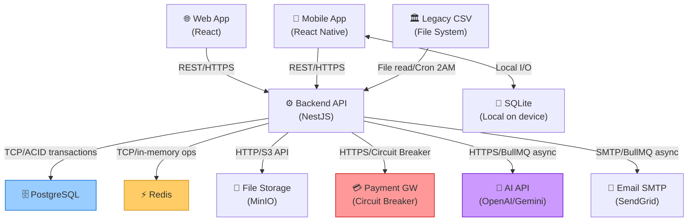

# UniHub Workshop — High-Level Architecture Diagram

> Sơ đồ này thể hiện **luồng dữ liệu và sự phụ thuộc** giữa các thành phần, đặc biệt tại các điểm tích hợp và luồng check-in offline.

---

## Sơ đồ tổng quan (Data Flow Architecture)

```
╔══════════════════════════════════════════════════════════════════════════════════════╗
║                          UniHub Workshop — High-Level Architecture                    ║
╠══════════════════════════════════════════════════════════════════════════════════════╣
║                                                                                        ║
║   CLIENT LAYER                                                                        ║
║   ────────────────────────────────────────────────────────────────                   ║
║   ┌──────────────────────┐      ┌──────────────────────────────┐                    ║
║   │      Web Browser     │      │        Mobile App            │                    ║
║   │   (React + Vite)     │      │     (React Native/Expo)      │                    ║
║   │                      │      │                              │                    ║
║   │  ┌──────────────┐   │      │  ┌────────────────────────┐  │                    ║
║   │  │Student Portal│   │      │  │    QR Scanner Screen   │  │                    ║
║   │  └──────────────┘   │      │  └────────────────────────┘  │                    ║
║   │  ┌──────────────┐   │      │  ┌────────────────────────┐  │                    ║
║   │  │ Admin Panel  │   │      │  │    SQLite Local Store   │  │                    ║
║   │  └──────────────┘   │      │  │  (pending_checkins)    │  │                    ║
║   └──────────┬───────────┘      │  └────────────────────────┘  │                    ║
║              │ HTTPS/REST       └─────────────┬────────────────┘                    ║
║              │                                │ HTTPS/REST (online)                  ║
║              │                                │ ⟳ Auto-sync when connected           ║
║              └─────────────────────────────────┘                                     ║
║                                    │                                                  ║
╠════════════════════════════════════╪═════════════════════════════════════════════════╣
║                                    │ HTTPS :3000                                      ║
║   BACKEND LAYER (NestJS)           ▼                                                  ║
║   ───────────────────────────────────────────────────────────────────────────────    ║
║   ┌──────────────────────────────────────────────────────────────────────────────┐  ║
║   │  INCOMING REQUEST PIPELINE                                                    │  ║
║   │                                                                                │  ║
║   │  ① [Rate Limit Guard] ──▶ ② [JWT Auth Guard] ──▶ ③ [Roles Guard]           │  ║
║   │     Redis Token Bucket        Verify JWT              Check RBAC role         │  ║
║   │     per user/IP               decode payload          STUDENT/ORGANIZER/      │  ║
║   │                                                        CHECKIN_STAFF          │  ║
║   │                                    │                                           │  ║
║   │                                    ▼                                           │  ║
║   │  ┌─────────────────────────────────────────────────────────────────────────┐  │  ║
║   │  │                      BUSINESS LOGIC MODULES                              │  │  ║
║   │  │                                                                           │  │  ║
║   │  │  ┌────────────┐  ┌────────────┐  ┌─────────────┐  ┌─────────────────┐  │  │  ║
║   │  │  │    Auth    │  │  Workshop  │  │ Registration│  │    Payment      │  │  │  ║
║   │  │  │   Module   │  │   Module   │  │   Module    │  │    Module       │  │  │  ║
║   │  │  │            │  │            │  │             │  │                 │  │  │  ║
║   │  │  │ JWT sign   │  │ CRUD       │  │ Seat lock   │  │ Circuit Breaker │  │  │  ║
║   │  │  │ JWT verify │  │ Capacity   │  │ QR generate │  │ Idempotency     │  │  │  ║
║   │  │  │ Password   │  │ Stats      │  │ Idempotency │  │ Retry policy    │  │  │  ║
║   │  │  └─────┬──────┘  └─────┬──────┘  └──────┬──────┘  └────────┬────────┘  │  │  ║
║   │  │        │               │                 │                   │           │  │  ║
║   │  │  ┌─────┴───────────────┴─────────────────┴─────────────────┘           │  │  ║
║   │  │  │                                                                       │  │  ║
║   │  │  ▼                                                                       │  │  ║
║   │  │  ┌────────────┐  ┌────────────┐  ┌─────────────┐                       │  │  ║
║   │  │  │  Checkin   │  │Notification│  │  AI Summary │                       │  │  ║
║   │  │  │   Module   │  │   Module   │  │   Module    │                       │  │  ║
║   │  │  │            │  │            │  │             │                       │  │  ║
║   │  │  │ Scan QR    │  │ Strategy   │  │ PDF parse   │                       │  │  ║
║   │  │  │ Batch sync │  │ Email+App  │  │ AI API call │                       │  │  ║
║   │  │  └────────────┘  └────────────┘  └─────────────┘                       │  │  ║
║   │  │                                                                           │  │  ║
║   │  │  ┌────────────────────────────────────────────────────────────────────┐  │  │  ║
║   │  │  │  BULLMQ WORKERS (chạy cùng process NestJS)                         │  │  │  ║
║   │  │  │  ┌─────────────────┐ ┌──────────────────┐ ┌────────────────────┐  │  │  │  ║
║   │  │  │  │Notification Wkr │ │  AI Summary Wkr  │ │  CSV Import Wkr   │  │  │  │  ║
║   │  │  │  │Email+App notify │ │ PDF→text→AI API  │ │ Cron 2AM nightly  │  │  │  │  ║
║   │  │  │  │Retry on fail    │ │ Retry on fail    │ │ Batch upsert      │  │  │  │  ║
║   │  │  │  └─────────────────┘ └──────────────────┘ └────────────────────┘  │  │  │  ║
║   │  │  └────────────────────────────────────────────────────────────────────┘  │  │  ║
║   │  └─────────────────────────────────────────────────────────────────────────┘  │  ║
║   └─────────────────────────────────────────────────────────────────┬──────────────┘  ║
║                                                                      │                 ║
╠══════════════════════════════════════════════════════════════════════╪════════════════╣
║                                                                      │                 ║
║   DATA LAYER                                                         │                 ║
║   ──────────────────────────────────────────────────────────────── │ ──────────────  ║
║        ┌────────────────────────────────────────────────────────────┘                 ║
║        │                                                                               ║
║        ├──────────────────────────────────────────────────────────────┐               ║
║        │                   │                         │                │               ║
║        ▼ TCP/pg             ▼ TCP/ioredis             ▼ HTTP/S3        │               ║
║  ┌──────────────┐   ┌──────────────────────┐   ┌──────────────┐      │               ║
║  │  PostgreSQL  │   │        Redis         │   │ File Storage │      │               ║
║  │  Port 5432   │   │      Port 6379       │   │  MinIO/Local │      │               ║
║  │              │   │                      │   │              │      │               ║
║  │ users        │   │ seat_count:{wid}     │   │ uploads/     │      │               ║
║  │ workshops    │   │ rate_limit:{uid}     │   │ *.pdf        │      │               ║
║  │ registrations│   │ idempotency:{key}   │   │              │      │               ║
║  │ payments     │   │ circuit_breaker:pay  │   │              │      │               ║
║  │ checkins     │   │ bull:{queue}:*       │   │              │      │               ║
║  │ sync_logs    │   │                      │   │              │      │               ║
║  └──────────────┘   └──────────────────────┘   └──────────────┘      │               ║
║                                                                        │               ║
╠════════════════════════════════════════════════════════════════════════╪══════════════╣
║                                                                        │               ║
║   EXTERNAL INTEGRATION LAYER                                           │               ║
║   ─────────────────────────────────────────────────────────────────── │ ───────────  ║
║        ┌────────────────────────────────────────────────────────────────┘               ║
║        │                   │                  │                  │                     ║
║        ▼ HTTPS             ▼ HTTPS            ▼ SMTP/HTTPS       ▼ File I/O (2AM)     ║
║  ┌──────────────┐  ┌──────────────┐  ┌──────────────┐  ┌─────────────────────┐      ║
║  │  Payment GW  │  │   AI API     │  │ Email Service│  │ Legacy Student CSV  │      ║
║  │  VNPay/mock  │  │ OpenAI/Gemini│  │ SendGrid/    │  │ /data/students.csv  │      ║
║  │              │  │              │  │ Nodemailer   │  │ (Cron reads file)   │      ║
║  │ Circuit      │  │ Retry 3x     │  │ Async via    │  │ No API available    │      ║
║  │ Breaker      │  │ BullMQ job   │  │ BullMQ job   │  │                     │      ║
║  └──────────────┘  └──────────────┘  └──────────────┘  └─────────────────────┘      ║
╚══════════════════════════════════════════════════════════════════════════════════════╝
```

---

## Luồng dữ liệu chi tiết tại các điểm tích hợp

### Luồng 1: Đăng ký Workshop có phí (Critical Path)

```
┌─────────┐       ┌──────────────┐       ┌─────────┐  ┌──────────────┐  ┌────────────┐
│ Student │       │  Backend API │       │  Redis  │  │  PostgreSQL  │  │ Payment GW │
│ Browser │       │  (NestJS)    │       │         │  │              │  │            │
└────┬────┘       └──────┬───────┘       └────┬────┘  └──────┬───────┘  └─────┬──────┘
     │                   │                    │               │                │
     │  POST /registrations                   │               │                │
     │  X-Idempotency-Key: {uuid}             │               │                │
     │──────────────────▶│                    │               │                │
     │                   │                    │               │                │
     │                   │ [① Rate Limit]     │               │                │
     │                   │──INCRBY key───────▶│               │                │
     │                   │◀─count / limit ────│               │                │
     │◀──429 (if over)───│                    │               │                │
     │                   │                    │               │                │
     │                   │ [② Auth Check]     │               │                │
     │                   │ Verify JWT locally │               │                │
     │◀──401 (if invalid)│                    │               │                │
     │                   │                    │               │                │
     │                   │ [③ Idempotency]    │               │                │
     │                   │──GET idempotency:{uuid}───────────▶│               │
     │                   │  (if found → return cached result) │               │
     │                   │                    │               │                │
     │                   │ [④ DB Transaction] │               │                │
     │                   │──BEGIN TXN ────────────────────────▶               │
     │                   │──SELECT seat FOR UPDATE ───────────▶               │
     │                   │◀──seat data ────────────────────────               │
     │                   │──INSERT registration (PENDING) ────▶               │
     │                   │──COMMIT ───────────────────────────▶               │
     │◀──409 (if full)───│                    │               │                │
     │                   │                    │               │                │
     │                   │ [⑤ Circuit Breaker check]          │                │
     │                   │──GET circuit_breaker:pay──────────▶│               │
     │                   │◀─CLOSED ──────────│               │                │
     │                   │                    │               │                │
     │                   │ [⑥ Payment]        │               │                │
     │                   │──charge ────────────────────────────────────────▶  │
     │                   │◀──success ──────────────────────────────────────   │
     │                   │                    │               │                │
     │                   │ [⑦ Confirm & QR]   │               │                │
     │                   │──UPDATE registration CONFIRMED ────▶               │
     │                   │──Generate QR (JWT signed) ────────▶               │
     │                   │                    │               │                │
     │                   │ [⑧ Store idempotency]             │                │
     │                   │──SET idempotency:{uuid} EX 86400─▶│               │
     │                   │                    │               │                │
     │                   │ [⑨ Async Notification via BullMQ] │                │
     │                   │──ENQUEUE notify job──────────────▶│               │
     │                   │                    │               │                │
     │◀──200 OK + QR ────│                    │               │                │
     │                   │                    │               │                │
```

**Điểm tích hợp quan trọng:**
- `Redis ①` — Rate limit gate (trước khi vào business logic)
- `Redis ③` — Idempotency (trước khi gọi DB)
- `PostgreSQL ④` — `SELECT FOR UPDATE` là cơ chế chống race condition chính
- `Payment GW ⑥` — Bọc bởi Circuit Breaker, failure không sập toàn hệ thống

---

### Luồng 2: Check-in Offline + Sync

```
┌───────────────────────────┐     ┌──────────────────┐     ┌──────────────┐  ┌──────────┐
│      Mobile App           │     │  Local SQLite    │     │  Backend API │  │PostgreSQL│
│  (React Native / Expo)    │     │                  │     │  (NestJS)    │  │          │
└──────────┬────────────────┘     └────────┬─────────┘     └──────┬───────┘  └────┬─────┘
           │                               │                       │               │
           │  === PHASE 1: OFFLINE MODE ===│                       │               │
           │                               │                       │               │
           │  Scan QR code                 │                       │               │
           │──decode JWT token             │                       │               │
           │  verify signature (offline)   │                       │               │
           │  ✅ Valid / ❌ Invalid         │                       │               │
           │                               │                       │               │
           │  INSERT pending_checkin       │                       │               │
           │──────────────────────────────▶│                       │               │
           │◀─ "✓ Đã ghi nhận (offline)" ─│                       │               │
           │                               │                       │               │
           │   ··· (có thể scan nhiều QR) ···                     │               │
           │                               │                       │               │
           │  === PHASE 2: RECONNECT ====  │                       │               │
           │                               │                       │               │
           │  NetInfo: connectivity ON     │                       │               │
           │  Read all pending checkins    │                       │               │
           │◀──────────────────────────────│                       │               │
           │                               │                       │               │
           │  POST /checkins/sync          │                       │               │
           │  [{ registration_id, scanned_at }, ...]               │               │
           │──────────────────────────────────────────────────────▶│               │
           │                               │                       │               │
           │                               │  INSERT ... ON CONFLICT DO NOTHING    │
           │                               │──────────────────────────────────────▶│
           │                               │◀── confirmed IDs ─────────────────────│
           │                               │                       │               │
           │◀── { confirmed: [...] } ──────────────────────────────│               │
           │                               │                       │               │
           │  DELETE confirmed from SQLite │                       │               │
           │──────────────────────────────▶│                       │               │
           │                               │                       │               │
```

**Điểm tích hợp quan trọng:**
- **JWT offline verify** — QR token có chữ ký server, mobile app verify mà không cần API call
- **SQLite local queue** — Buffer cho mọi check-in khi offline
- **`ON CONFLICT DO NOTHING`** — Sync idempotent, gửi nhiều lần vẫn an toàn

---

### Luồng 3: CSV Import Nightly (Legacy System Integration)

```
┌──────────────────────┐    ┌──────────────────┐    ┌──────────────┐    ┌──────────────┐
│   Cron Scheduler     │    │   CSV File       │    │  Validator   │    │  PostgreSQL  │
│  (NestJS @Cron)      │    │  /data/*.csv     │    │  (Row level) │    │              │
└──────────┬───────────┘    └────────┬─────────┘    └──────┬───────┘    └──────┬───────┘
           │                         │                      │                    │
           │  === 2:00 AM TRIGGER === │                      │                    │
           │                         │                      │                    │
           │  Trigger: CsvImportJob  │                      │                    │
           │──read stream (csv file) │                      │                    │
           │──────────────────────────▶                     │                    │
           │◀── Row stream ──────────                       │                    │
           │                         │                      │                    │
           │  For each chunk (500 rows):                    │                    │
           │  ──────────────────────────────────────────    │                    │
           │                                                │                    │
           │──validate row──────────────────────────────────▶                   │
           │  check: MSSV format, email format              │                    │
           │◀── valid / { error: reason } ─────────────────│                    │
           │                                                │                    │
           │  (invalid rows → error_list, continue)         │                    │
           │                                                │                    │
           │  INSERT INTO users (student_id, email, full_name)                  │
           │  ON CONFLICT (student_id)                      │                    │
           │  DO UPDATE SET email=EXCLUDED.email, ...       │                    │
           │────────────────────────────────────────────────────────────────────▶
           │◀── success count ──────────────────────────────────────────────────
           │                                                │                    │
           │  INSERT INTO student_sync_logs                 │                    │
           │  (file_name, total, success, errors, error_details::JSONB)          │
           │────────────────────────────────────────────────────────────────────▶
           │                                                │                    │
```

**Điểm tích hợp quan trọng:**
- **Không có API từ Legacy System** — Chỉ đọc file CSV từ filesystem/SFTP mount
- **Stream reading** — Không load toàn bộ file vào RAM, đọc từng dòng
- **UPSERT (ON CONFLICT)** — Chạy lại an toàn, không tạo duplicate
- **Audit log** — Mọi import đều có log `student_sync_logs` để trace

---

### Luồng 4: AI Summary (Async Integration)

```
┌─────────────┐   ┌──────────────┐   ┌─────────────┐   ┌─────────┐   ┌──────────┐
│  Admin Web  │   │  Backend API │   │File Storage │   │  Redis  │   │  AI API  │
│  (Browser)  │   │  (NestJS)    │   │(MinIO/Local)│   │ BullMQ  │   │(OpenAI)  │
└──────┬──────┘   └──────┬───────┘   └──────┬──────┘   └────┬────┘   └────┬─────┘
       │                 │                   │               │               │
       │  POST /workshops/:id/upload-pdf      │               │               │
       │  Content-Type: multipart/form-data   │               │               │
       │────────────────▶│                   │               │               │
       │                 │                   │               │               │
       │                 │──Save PDF file ──▶│               │               │
       │                 │◀── file_path ─────│               │               │
       │                 │                   │               │               │
       │                 │──Enqueue ai-summary job ─────────▶│               │
       │                 │  { workshop_id, file_path }        │               │
       │◀── 202 Accepted─│  "PDF đang xử lý..."              │               │
       │                 │                   │               │               │
       │                 │                   │  === ASYNC (BullMQ Worker) === │
       │                 │                   │               │               │
       │                 │                   │  Dequeue job ─│               │
       │                 │──read PDF ────────────────────────│               │
       │                 │  pdf-parse → text │               │               │
       │                 │                   │               │               │
       │                 │──POST /v1/chat/completions ──────────────────────▶│
       │                 │  { model, messages: [{role: user, content: text}] }│
       │                 │◀── { summary } ───────────────────────────────────│
       │                 │                   │               │               │
       │                 │──UPDATE workshops SET ai_summary = ...            │
       │                 │  (via PostgreSQL)  │               │               │
       │                 │                   │               │               │
       │  (Admin polls / websocket notify)   │               │               │
       │◀── AI Summary ready ───────────────────────────────────────────────  │
       │                 │                   │               │               │
```

---

## Dependency Map — Sự phụ thuộc giữa các thành phần



### Tóm tắt độ phụ thuộc (Criticality)

```
┌─────────────────────────────────────────────────────────────────────┐
│                     DEPENDENCY CRITICALITY                           │
├────────────────────┬──────────────┬──────────────────────────────── │
│ Dependency         │ Criticality  │ Fallback strategy               │
├────────────────────┼──────────────┼──────────────────────────────── │
│ PostgreSQL         │ 🔴 Critical  │ Không có fallback → DB HA       │
│ Redis              │ 🟡 Important │ Fallback DB, nhưng degraded     │
│ Payment GW         │ 🟡 Important │ Circuit Breaker → graceful error │
│ AI API             │ 🟢 Optional  │ BullMQ retry → workshop vẫn OK  │
│ Email SMTP         │ 🟢 Optional  │ BullMQ retry → core flow OK     │
│ Legacy CSV         │ 🟡 Important │ Log error, alert admin          │
│ File Storage       │ 🟡 Important │ PDF upload fails, rest OK       │
│ SQLite (mobile)    │ 🟡 Important │ Check-in offline-only mode      │
└────────────────────┴──────────────┴─────────────────────────────────┘
```

---

## Luồng dữ liệu — Real-time Seat Count

> Đây là điểm nhạy cảm nhất: 12.000 SV đọc seat count đồng thời.

```
Đọc seat count (GET /workshops):
   Backend ──GET seat_count:{workshop_id}──▶ Redis   (cache hit: < 1ms)
   Backend ──fallback nếu cache miss──────▶ PostgreSQL (COUNT registrations)
   Redis ←──SET seat_count:{id} EX 60────── Backend (refresh cache 60s)

Khi có người đăng ký thành công:
   PostgreSQL ──INSERT registration──▶ commit
   Redis ──DECR seat_count:{workshop_id}──▶ atomic -1

Khi có người hủy:
   PostgreSQL ──UPDATE registration CANCELLED──▶ commit
   Redis ──INCR seat_count:{workshop_id}──▶ atomic +1

⚠️ Source of truth: PostgreSQL (COUNT registrations WHERE status='CONFIRMED')
   Redis chỉ là approximate cache, không là source of truth
```

---

*Tài liệu này là Phần 3/3 trong bộ tài liệu thiết kế. Xem thêm:*  
*`1-system-design.md` — Tài liệu thiết kế hệ thống*  
*`2-c4-diagram.md` — C4 Diagram Level 1 & Level 2*
