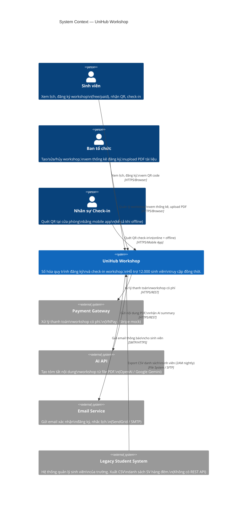

# UniHub Workshop — C4 Diagram

> **Tham khảo:** [C4 Model](https://c4model.com/)  
> Tài liệu này trình bày **Level 1 (System Context)** và **Level 2 (Container)** của C4 Model.

---

## Level 1 — System Context Diagram

> **Câu hỏi trả lời:** UniHub Workshop tồn tại trong bức tranh toàn cảnh nào? Ai dùng? Hệ thống ngoài nào được tích hợp?



### Mô tả textual (ASCII — cho môi trường không render Mermaid)

```
╔══════════════════════════════════════════════════════════════════════════╗
║                         System Context                                    ║
║                                                                            ║
║   [Sinh viên]        [Ban tổ chức]       [Nhân sự Check-in]              ║
║   • Xem lịch         • Tạo/sửa/hủy      • Quét QR tại cửa phòng         ║
║   • Đăng ký           workshop           • Offline support                ║
║   • Nhận QR          • Xem thống kê                                       ║
║       │                  │                        │                        ║
║       └──────────────────┼────────────────────────┘                        ║
║                          ▼ (HTTPS)                                         ║
║              ┌─────────────────────────┐                                   ║
║              │    UniHub Workshop      │                                   ║
║              │  (Hệ thống trung tâm)  │                                   ║
║              └────────────┬────────────┘                                   ║
║                           │                                                ║
║      ┌────────────────────┼────────────────────────┐                       ║
║      │                    │                        │                       ║
║      ▼ HTTPS              ▼ HTTPS             ▼ SMTP                      ║
║  [Payment GW]         [AI API]          [Email Service]                   ║
║  VNPay/Stripe         OpenAI/Gemini     SendGrid/SMTP                     ║
║  Thanh toán có phí    PDF → Summary     Email xác nhận                    ║
║                                                                            ║
║                    ▲ CSV File (2AM nightly)                                ║
║              [Legacy Student System]                                       ║
║              Hệ thống quản lý SV của trường                               ║
║              Không có API, chỉ export CSV                                  ║
╚══════════════════════════════════════════════════════════════════════════╝
```

### Bảng tóm tắt Actors & External Systems

| Actor / System | Loại | Mô tả tương tác |
|---|---|---|
| **Sinh viên** | User | Đăng ký workshop, nhận QR, check-in tại cửa |
| **Ban tổ chức** | User | Tạo workshop, quản lý nội dung, xem dashboard |
| **Nhân sự Check-in** | User | Dùng mobile app quét QR, hỗ trợ offline |
| **Payment Gateway** | External System | Nhận lệnh charge từ UniHub, trả kết quả |
| **AI API** | External System | Nhận text từ PDF, trả AI summary |
| **Email Service** | External System | Nhận request gửi mail từ UniHub |
| **Legacy Student System** | External System | Push CSV file ra filesystem mỗi đêm |

---

## Level 2 — Container Diagram

> **Câu hỏi trả lời:** UniHub Workshop bên trong gồm những container nào? Công nghệ gì? Chúng giao tiếp ra sao?

```mermaid
C4Container
    title Container Diagram — UniHub Workshop

    Person(student, "Sinh viên", "Đăng ký workshop, xem QR")
    Person(organizer, "Ban tổ chức", "Quản lý workshop")
    Person(checkin_staff, "Nhân sự Check-in", "Quét QR check-in")

    System_Boundary(unihub, "UniHub Workshop") {
        Container(web_app, "Web App", "React + TypeScript + Vite\nPort: 5173 (dev) / 80 (prod)",
            "Student portal: xem lịch, đăng ký, xem QR\nAdmin dashboard: CRUD workshop, thống kê, upload PDF")

        Container(mobile_app, "Mobile App", "React Native / Expo\niOS + Android",
            "QR scanner cho nhân sự check-in\nOffline mode: lưu SQLite local\nAuto-sync khi có mạng")

        Container(backend_api, "Backend API", "NestJS (Node.js + TypeScript)\nPort: 3000",
            "REST API server\nBusiness logic: đăng ký, thanh toán, check-in\nRBAC (JWT + Guards)\nBullMQ workers (chạy cùng process)")

        ContainerDb(postgres, "PostgreSQL", "PostgreSQL 15\nPort: 5432",
            "Dữ liệu chính: users, workshops,\nregistrations, payments,\ncheckins, sync_logs\nACID transactions")

        ContainerDb(redis, "Redis", "Redis 7\nPort: 6379",
            "Cache: seat count\nRate limit: token bucket\nIdempotency store\nBullMQ job queue\nCircuit breaker state")

        Container(file_storage, "File Storage", "MinIO (S3-like) hoặc\nLocal filesystem /uploads",
            "Lưu PDF tài liệu workshop\nUpload từ ban tổ chức")
    }

    System_Ext(payment_gw, "Payment Gateway", "VNPay / Stripe mock\nXử lý thanh toán")
    System_Ext(ai_api, "AI API", "OpenAI / Google Gemini\nPDF → Summary")
    System_Ext(email_service, "Email Service", "SendGrid / Nodemailer + SMTP\nGửi email thông báo")
    System_Ext(legacy_system, "Legacy Student System", "Export CSV danh sách SV hàng đêm")

    %% User → Container
    Rel(student, web_app, "Xem lịch, đăng ký, xem QR", "HTTPS")
    Rel(organizer, web_app, "Quản lý workshop, upload PDF", "HTTPS")
    Rel(checkin_staff, mobile_app, "Quét QR, check-in", "Tap/Camera")

    %% Container → Backend API
    Rel(web_app, backend_api, "REST API calls", "HTTPS/JSON")
    Rel(mobile_app, backend_api, "REST API calls,\noffline sync batch", "HTTPS/JSON")

    %% Backend API → Data stores
    Rel(backend_api, postgres, "Read/Write dữ liệu nghiệp vụ\n(transactions, SELECT FOR UPDATE)", "TCP/pg driver")
    Rel(backend_api, redis, "Cache, rate limit, queue,\nidempotency, circuit breaker state", "TCP/ioredis")
    Rel(backend_api, file_storage, "Upload/Download PDF files", "HTTP/S3 API")

    %% Backend API → External
    Rel(backend_api, payment_gw, "Charge thanh toán\n(Circuit Breaker bao bọc)", "HTTPS/REST")
    Rel(backend_api, ai_api, "Gửi text PDF,\nnhận AI summary (BullMQ job)", "HTTPS/REST")
    Rel(backend_api, email_service, "Gửi email\n(BullMQ job)", "SMTP/HTTPS")

    %% Legacy → Backend
    Rel(legacy_system, backend_api, "CSV file export\n(Cron 2AM đọc file)", "File System/SFTP")

    UpdateLayoutConfig($c4ShapeInRow="3", $c4BoundaryInRow="1")
```

### Mô tả textual (ASCII)

```
╔══════════════════════════════════════════════════════════════════════════════╗
║  UniHub Workshop — Container Diagram                                          ║
║                                                                                ║
║  ┌──────────────┐   ┌──────────────┐   ┌──────────────────────────────────┐  ║
║  │   Web App    │   │  Mobile App  │   │         Backend API               │  ║
║  │              │   │              │   │         (NestJS :3000)            │  ║
║  │ React + TS   │   │ React Native │   │                                   │  ║
║  │ + Vite       │   │ / Expo       │   │  ┌─────────┐  ┌──────────────┐  │  ║
║  │              │   │              │   │  │  Auth   │  │  Workshop    │  │  ║
║  │ Student      │   │ QR Scanner   │   │  │  Module │  │  Module      │  │  ║
║  │ Portal +     │   │ Offline:     │   │  ├─────────┤  ├──────────────┤  │  ║
║  │ Admin        │   │ SQLite local │   │  │Payment  │  │  Checkin     │  │  ║
║  │ Dashboard    │   │ Auto-sync    │   │  │  Module │  │  Module      │  │  ║
║  └──────┬───────┘   └──────┬───────┘   │  ├─────────┤  ├──────────────┤  │  ║
║         │                  │           │  │ Notif.  │  │  AI Summary  │  │  ║
║         └──────REST/HTTPS──┘           │  │  Module │  │  Module      │  │  ║
║                   │                   │  ├─────────┤  ├──────────────┤  │  ║
║                   └─────REST/HTTPS───▶│  │CSV Sync │  │  Users       │  │  ║
║                                        │  │  Module │  │  Module      │  │  ║
║                                        │  └─────────┘  └──────────────┘  │  ║
║                                        │                                   │  ║
║                                        │  ┌────────────────────────────┐  │  ║
║                                        │  │   BullMQ Workers           │  │  ║
║                                        │  │ [Notification] [AI] [CSV]  │  │  ║
║                                        │  └────────────────────────────┘  │  ║
║                                        └────────────────┬──────────────────┘  ║
║                                                         │                      ║
║                      ┌──────────────────────────────────┤                     ║
║                      │                  │               │                     ║
║                      ▼ TCP              ▼ TCP           ▼ HTTP               ║
║              ┌──────────────┐   ┌──────────────┐   ┌──────────────┐         ║
║              │  PostgreSQL  │   │    Redis     │   │ File Storage │         ║
║              │  Port 5432   │   │  Port 6379   │   │ MinIO/Local  │         ║
║              │              │   │              │   │              │         ║
║              │ users        │   │ seat_count:* │   │ /uploads/    │         ║
║              │ workshops    │   │ rate_limit:* │   │ *.pdf        │         ║
║              │ registrations│   │ idempotency:*│   │              │         ║
║              │ payments     │   │ BullMQ queue │   │              │         ║
║              │ checkins     │   │ cb:payment   │   │              │         ║
║              └──────────────┘   └──────────────┘   └──────────────┘         ║
║                                                                                ║
║  ─ ─ ─ External Services ─ ─ ─                                               ║
║  [Payment GW]  [AI API]  [Email SMTP]  [Legacy CSV System]                   ║
╚══════════════════════════════════════════════════════════════════════════════╝
```

### Bảng container chi tiết

| Container | Công nghệ | Port | Vai trò chính |
|-----------|-----------|------|---------------|
| **Web App** | React 18 + TypeScript + Vite | 5173 (dev) / 80 | Student portal + Admin dashboard |
| **Mobile App** | React Native / Expo | N/A | QR scanner, offline check-in |
| **Backend API** | NestJS (Node.js 20 LTS) | 3000 | REST API, business logic, RBAC guards, BullMQ workers |
| **PostgreSQL** | PostgreSQL 15 | 5432 | Dữ liệu chính: users, workshops, registrations, payments, checkins |
| **Redis** | Redis 7 | 6379 | Cache, rate limit, job queue, idempotency store, circuit breaker state |
| **File Storage** | MinIO (S3-like) / Local FS | 9000 | Lưu PDF tài liệu upload |

### Bảng API chính (Backend → Client contract)

| HTTP Method | Endpoint | Auth | Mô tả |
|-------------|----------|------|-------|
| `POST` | `/auth/login` | Public | Đăng nhập, nhận JWT |
| `GET` | `/workshops` | Public | Danh sách workshop + remaining seats |
| `GET` | `/workshops/:id` | Public | Chi tiết workshop |
| `POST` | `/workshops` | ORGANIZER | Tạo workshop |
| `PUT` | `/workshops/:id` | ORGANIZER | Cập nhật workshop |
| `DELETE` | `/workshops/:id` | ORGANIZER | Hủy workshop |
| `GET` | `/workshops/stats` | ORGANIZER | Thống kê đăng ký |
| `POST` | `/workshops/:id/upload-pdf` | ORGANIZER | Upload PDF → AI summary |
| `POST` | `/registrations` | STUDENT | Đăng ký workshop (free/paid) |
| `GET` | `/registrations/my` | STUDENT | Lịch đăng ký của tôi |
| `POST` | `/checkins/scan` | CHECKIN_STAFF | Xác nhận QR (online) |
| `POST` | `/checkins/sync` | CHECKIN_STAFF | Batch sync offline checkins |
| `POST` | `/admin/csv-sync/trigger` | ORGANIZER | Manual trigger CSV import |

---

*Tài liệu này là Level 1 và Level 2 của C4 Model. Level 3 (Component) và Level 4 (Code) có thể bổ sung sau khi triển khai.*
